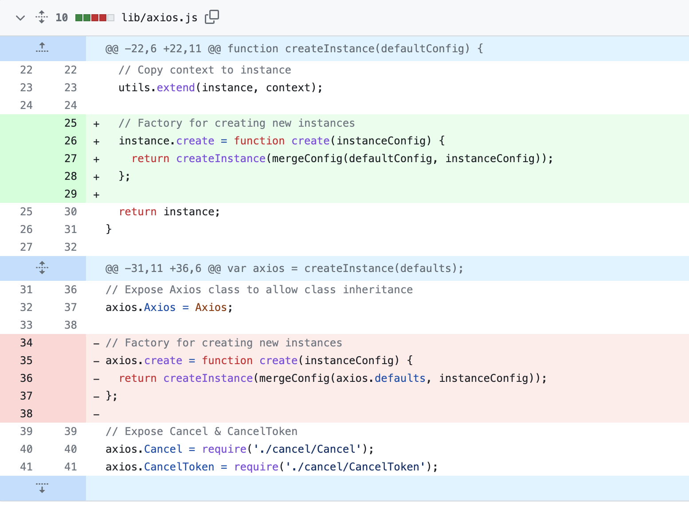

# Axios 源码解析

## 什么是 Axios

> Axios is a [promise-based](https://javascript.info/promise-basics) HTTP Client for [node.js](https://nodejs.org/) and the browser. It is [isomorphic](https://www.lullabot.com/articles/what-is-an-isomorphic-application) (= it can run in the browser and node.js with the same codebase). On the server-side it uses the native node.js http module, while on the client (browser) it uses XMLHttpRequests.

Axios 是一个基于 promise 的***网络请求库***，通过使用它我们可以非常轻松的发起请求。它是 ***isomorphic*** 的（也即同一套代码可以同时运行在 node.js 环境和浏览器环境中）。在服务端它使用了 node.js 原生的 `http` 模块，而在浏览器端则使用了 `XMLHttpRequest`

## Why Axios

Axios 本身就支持了非常多强大的功能和特性，同时有着很强的社区支持，其易于使用、易于封装魔改的特性也备受开发人员的青睐。Axios 的主要特性包括

  - 支持 Promise API
  - 请求/响应拦截器
  - 转换请求和响应数据
  - 支持手动取消请求
  - 超时处理
  - ... ...

在简单的了解了 Axios 是什么和它的基本特性之后，让我们正式开始了解 Axios 的源码吧～

## 起点

Axios 的起点在 `./lib/axios.js` 文件中([https://github.com/axios/axios/blob/v1.x/lib/axios.js](https://github.com/axios/axios/blob/v1.x/lib/axios.js))，我们可以从这里开始分析。
```js
// 根据配置构建上下文对象，包括默认配置和请求、响应拦截器对象
function createInstance(defaultConfig) {
  
  const context = new Axios(defaultConfig);

  // 创建实例 -> bind后返回的是一个函数，并且上下文指向context
  // 这也就是为什么我们使用的时候可以直接 axios(config) 这样使用，并且确保了上下文指向我们的context
  const instance = bind(Axios.prototype.request, context);

  // 拷贝prototype到实例上 类似于把Axios的原型上的方法(例如: request、get、post...)继承到实例上，this指向为context
  utils.extend(instance, Axios.prototype, context, {allOwnKeys: true});

  // 拷贝上下文对象属性(默认配置和请求、相应拦截器对象)到实例上， this指向为context
  utils.extend(instance, context, null, {allOwnKeys: true});

  // axios.create 调用的就是这里的 create 方法
  instance.create = function create(instanceConfig) {
    // 注意这里面的mergeConfig, instanceConfig是我们调用 axios.create(config) 中的 config
    // 然后我们将 defaultConfig 与 instanceConfig 合并，此后该 config 就将包含很多 default 的配置项
    return createInstance(mergeConfig(defaultConfig, instanceConfig));
  };

  // 返回这个实例
  return instance;
}

// 创建一个 Axios 对象，也是我们默认 export 出去的对象
const axios = createInstance(defaults);

// 暴露 Axios class
axios.Axios = Axios;

// 暴露 Cancel & CancelToken，以便后续手动中断请求
axios.CanceledError = CanceledError;
axios.CancelToken = CancelToken;
axios.isCancel = isCancel;
axios.VERSION = VERSION;
axios.toFormData = toFormData;

// 暴露 AxiosError class
axios.AxiosError = AxiosError;

// Cancel 作为 CanceledError 的别名
axios.Cancel = axios.CanceledError;

// 暴露 all 方法处理并发请求，本质上是复用了 Promise.all
axios.all = function all(promises) {
  return Promise.all(promises);
};

axios.spread = spread;

axios.isAxiosError = isAxiosError;

axios.AxiosHeaders = AxiosHeaders;

axios.formToJSON = thing => formDataToJSON(utils.isHTMLForm(thing) ? new FormData(thing) : thing);

// 默认导出
export default axios
```
可以看到，在 `axios.js` 中，其实只做了三件事情：
1. 首先声明了一个创建 Axios 实例的 `createInstance` 方法
2. 主动调用了这个方法创建了一个默认的实例，因此，当我们使用 `import axios from 'axios'`时，得到的也是这个刚创建的 Axios 实例。
3. 为这个实例增加 Axios/ CanceledError/ isCancel/ ... 等属性和方法

除此以外，我们可以看到，在我们平时开发的时候也可以使用 `const myAxios = axios.create(config)` 通过自定义配置新建一个实例，而这个方法也是在 `createInstance` 方法中被定义到了 axios 实例上！
但是我们发现， 只有`create` 这个方法定义在了 `createInstance` 内部，这则改动与这条 PR 有关 [https://github.com/axios/axios/pull/2795](https://github.com/axios/axios/pull/2795)，可以看到，在之前，我们调用 `create(customConfig)` 创建新的实例的时候，都只能够合并 customConfig 和 axios.defaults，这则改动之后，我们可以获取到当前 Axios 实例创建时的配置，然后基于这个配置，进行二次创建 Axios。因此，***增强了 config 的复用能力***。



 
## 核心

Axios 的核心就是 `class Axios`，位于  `./lib/core/Axios.js` 文件中([https://github.com/axios/axios/blob/v1.x/lib/core/Axios.js](https://github.com/axios/axios/blob/v1.x/lib/core/Axios.js))。这个文件的结构大致如下
```js
class Axios {
	constructor(instanceConfig) {...}
	request(configOrUrl, config) {...} // Key Part!
	getUri(config) {...}
}

utils.forEach(['delete', 'get', 'head', 'options'], function forEachMethodNoData(method){...})
utils.forEach(['post', 'put', 'patch'], function forEachMethodWithData(method){...})
```

### `constructor`
在 constructor 中，我们定义了基本的 instance 配置和 interceptors 拦截链
```js
constructor(instanceConfig) {
    this.defaults = instanceConfig;   // instance 配置
    this.interceptors = {             // 拦截链
      request: new InterceptorManager(),  // InterceptorManager 是一个对象，包含了 use、eject、forEach 方法
      response: new InterceptorManager()
    };
  }
```

### `utils.forEach`

```js
// 这里将无body数据的请求挂载到prototype中
utils.forEach(['delete', 'get', 'head', 'options'], function forEachMethodNoData(method) {
  /*eslint func-names:0*/
  Axios.prototype[method] = function(url, config) {
    // 注意本质上仍然是调用request方法
    return this.request(mergeConfig(config || {}, {
      method,
      url,
      data: (config || {}).data
    }));
  };
});

// 这里将有body数据的请求挂载到prototype中
utils.forEach(['post', 'put', 'patch'], function forEachMethodWithData(method) {
  /*eslint func-names:0*/
  function generateHTTPMethod(isForm) {
    return function httpMethod(url, data, config) {
      // 注意本质上仍然是调用request方法
      return this.request(mergeConfig(config || {}, {
        method,
        headers: isForm ? {
          'Content-Type': 'multipart/form-data'
        } : {},
        url,
        data
      }));
    };
  }

  // 调用generateHTTPMethod得到一个函数 -> 为什么要多这么一层闭包呢 -> 怀疑跟作用域有关
  Axios.prototype[method] = generateHTTPMethod(); 

  Axios.prototype[method + 'Form'] = generateHTTPMethod(true);
});
```
两个 utils.forEach 其实做的事情差不多，都是想要为 `Axios.prototype[method]` 增加对应的方法。关注源码会发现，**本质上都是使用了 Axios Class 中定义的`request`方法**。
之所以要区分成两个 utils.forEach，是因为后面的三个方法 (post, put, patch) 在调用的时候支持传入 data，所以需要差异化处理。

### `request`

```js
request(configOrUrl, config) {
    /*eslint no-param-reassign:0*/
    // 支持不同的请求形式axios('url',config) / axios(config)
    if (typeof configOrUrl === 'string') {
      config = config || {};
      config.url = configOrUrl;
    } else {
      config = configOrUrl || {};
    }

    // 这一步最后会将基础的对象和request时候传入的对象合并起来 并赋值给 config
    config = mergeConfig(this.defaults, config);

    const {transitional, paramsSerializer} = config;
    if (transitional !== undefined) {
      validator.assertOptions(transitional, {
        silentJSONParsing: validators.transitional(validators.boolean),
        forcedJSONParsing: validators.transitional(validators.boolean),
        clarifyTimeoutError: validators.transitional(validators.boolean)
      }, false);
    }

    if (paramsSerializer !== undefined) {
      validator.assertOptions(paramsSerializer, {
        encode: validators.function,
        serialize: validators.function
      }, true);
    }

    // 获取当前调用的方法，由于有一步toLowerCase，因此你的method写成形如GET或者get都是可以接受的  
    // 如果没有配置 method 属性，默认为 get 方法
    config.method = (config.method || this.defaults.method || 'get').toLowerCase();

    // Flatten headers
    const defaultHeaders = config.headers && utils.merge(
      config.headers.common,
      config.headers[config.method]
    );

    defaultHeaders && utils.forEach(
      ['delete', 'get', 'head', 'post', 'put', 'patch', 'common'],
      function cleanHeaderConfig(method) {
        delete config.headers[method];
      }
    );

    // 基于目前的header，创建一个AxiosHeaders对象
    config.headers = new AxiosHeaders(config.headers, defaultHeaders);

    // filter out skipped interceptors
    // request的拦截链
    const requestInterceptorChain = [];
    let synchronousRequestInterceptors = true; // 整个执行链的执行方式 -> 如果不加任何的 interceptor，就默认是 true(同步) / 如果加了 requestInterceptor，则需要考虑拦截器的配置
    this.interceptors.request.forEach(function unshiftRequestInterceptors(interceptor) {
      // 配置 requestInterceptors 的时候，支持输入一个 runWhen 属性，这是一个函数，当且仅当该函数返回值为 true 的时候，才会执行这个 interceptors
      // 如果不输入的话，那么无论如何都会执行这个 interceptors
      // 只有 requestInterceptors 针对 runWhen 进行了处理，responseInterceptors 可以接受 runWhen 配置，但是不会做任何处理
      if (typeof interceptor.runWhen === 'function' && interceptor.runWhen(config) === false) {
        return;
      }
  
      // interceptor.synchronous 是对外提供的配置，可标识该拦截器是异步还是同步 默认为false(异步) 
      // 如果任意一个请求拦截器为false(异步) 那么会将整个执行链的方式同步为异步
      // 如果所有的请求拦截器都是true(同步) 那么才会将整个执行链的方式变为同步
      // synchronousRequestInterceptors 会决定下面的 promise 执行链使用不同的执行方式
      synchronousRequestInterceptors = synchronousRequestInterceptors && interceptor.synchronous;

      // 注意这里的unshift，所以先声明的 request interceptor 反而会后执行
      requestInterceptorChain.unshift(interceptor.fulfilled, interceptor.rejected);
    });

    // response的拦截链 -> responseInterceptorChain 中的同步或者异步性质不会影响 synchronousRequestInterceptors 属性
    const responseInterceptorChain = [];
    this.interceptors.response.forEach(function pushResponseInterceptors(interceptor) {
      responseInterceptorChain.push(interceptor.fulfilled, interceptor.rejected);
    });

    let promise;
    let i = 0;
    let len;

    // 如果 synchronousRequestInterceptors 是 false(异步), 就进入这里的逻辑(不过默认是异步)
    // 因此 我们必须在每一个 interceptor 处显式的声明 synchronous: true 才能让最终的拦截链变成同步
    if (!synchronousRequestInterceptors) {
      const chain = [dispatchRequest.bind(this), undefined];
      chain.unshift.apply(chain, requestInterceptorChain);
      chain.push.apply(chain, responseInterceptorChain);
      // chain = [...requestInterceptorChain, dispatchRequest.bind(this), undefined, ...responseInterceptorChain]
      len = chain.length;

      // 永远都是先对输入的配置config进行一次调用(下面while循环中最一开始 onFulfilled(newConfig) 里的config也是输入的配置)
      promise = Promise.resolve(config);

      // 循环执行chain上的每一条
      while (i < len) {
        // 注意到这里是异步的，所以会不断进行链式调用 (而下面的是同步的，所以会同步进行onFulfilled来调用)
        promise = promise.then(chain[i++], chain[i++]);
      }

      // 返回Promise对象
      return promise;
    }

    // 从这里开始是同步的逻辑 =========================================
    len = requestInterceptorChain.length;

    let newConfig = config;

    i = 0;

    // 先处理 requestInterceptor
    while (i < len) {
      const onFulfilled = requestInterceptorChain[i++]; // onFulfilled 和 onRejected 都是一个function
      const onRejected = requestInterceptorChain[i++];
      try {
        newConfig = onFulfilled(newConfig); // 每一个interceptor都会返回一个config 并且作为下一个interceptor的入参
      } catch (error) {
        onRejected.call(this, error);
        break;
      }
    }

    // 如果配置了request interceptor -> 使用最后通过request interceptor获得的config 来调用 dispatchRequest 方法
    // 如果没有配置 request interceptor -> 使用用户输入的 config 来调用该 dispatchRequest 方法
    try {
      promise = dispatchRequest.call(this, newConfig);  // 此时的请求发起被放在了 macrotask 中（而在异步的情况下，请求发起是放在了 microtask 中）
    } catch (error) {
      return Promise.reject(error);
    }

    i = 0;
    len = responseInterceptorChain.length;

    // 响应拦截器执行 -> 针对 dispatchRequest 返回的promise对象进行处理和链式调用
    while (i < len) {
      promise = promise.then(responseInterceptorChain[i++], responseInterceptorChain[i++]);
    }

    // 返回 Promise 实例
    return promise;
  }
```

request 方法可以说是 Axios 最为重要和复杂的部分！实际上做了四件事情

- 根据 axios 实例创建似的配置 + 用户发起请求时的配置，配置最终的 config
- 处理 RequestInterceptors + ResponseInterceptors
- 执行 RequestInterceptors + `dispatchRequest.call(this, newConfig)` 执行请求 + 执行 ResponseInterceptors
- 返回最终的 Promise 对象

而其中，最为复杂的部分其实就是 interceptors 相关的了！目前版本中的代码又是判断同步又是判断异步，真的非常复杂（可恶！）。而曾经的 interceptors 逻辑可就简单多了：
```js
  // 创建存储链式调用的数组 首位是核心调用方法dispatchRequest，第二位是空
  var chain = [dispatchRequest, undefined];
  // 创建 promise 
  var promise = Promise.resolve(config);
  // 队头插入请求拦截器
  this.interceptors.request.forEach(function unshiftRequestInterceptors(interceptor) {
    chain.unshift(interceptor.fulfilled, interceptor.rejected);
  });
  // 队尾插入响应拦截器
  this.interceptors.response.forEach(function pushResponseInterceptors(interceptor) {
    chain.push(interceptor.fulfilled, interceptor.rejected);
  });
  // 循环 每次取两个出来组成promise链
  while (chain.length) {
    promise = promise.then(chain.shift(), chain.shift());
  }

  return promise;
```
曾经的 interceptors 本质上就是构建一个数组 chain，chain 中包含了真正实现请求的方法(`dispatchRequest`)，然后往队头不断插入 RequestInterceptors，队尾不断插入 ResponseInterceptors。执行的时候不断调用 `promise.then()` 即可。
简单的对比会发现，在现在的源码中，如果我们的 `synchronousRequestInterceptors` 属性最终是 false，其实完全沿用了之前版本的逻辑！

而现在的代码实际上就是多了两件事情

- 判断 RequestInterceptors 是否同步
- 如果异步，则沿用之前的 Promise 链的逻辑；如果同步，则使用新逻辑（直接 macrotask 中调用）

这个改动的动机其实来自于这个 PR [https://github.com/axios/axios/issues/2609](https://github.com/axios/axios/issues/2609)
在这个 PR 中，发起者提出了这么一种情况 (下面的例子简化了一下)
```js
axios.get('/a')
axios.get('/b')

var request = new XMLHttpRequest
request.open('get', 'c')
request.send()
```
从直觉上，我们可能会认为发起请求的顺序是 `'a' -> 'b' -> 'c'`。但是实际上由于曾经的逻辑会默认将 Axios 发起的请求放到当前事件循环的 microtask 队列中（因为发起请求的逻辑在 `Promise.resolve(config).then()` 中），因此实际发起请求的逻辑是 `'c' -> 'a' -> 'b'`
尽管这不符合我们的直觉，但是尚且可以接受，毕竟可能请求之间只会相差几十毫秒。但是！如果说当前的 macrotask 中有一个非常非常慢的任务呢？
```js
axios.get('/a')
axios.get('/b')

var request = new XMLHttpRequest
request.open('get', 'c')
request.send()

syncHeavyComputationTask() // 一个非常慢的同步任务
```
在这种情况下，可能 Axios 发出的请求会比请求 c 慢了几百毫秒甚至数秒，因为要先执行完 macrotask 中的任务。这显然是不符合预期的！因此，才有了这次针对 RequestInterceptor 的改动。
回看 request 方法的源代码，我们会发现，如果没有 RequestInterceptors 或者所有的 RequestInterceptors 都被设置成了 sync。那么在处理 RequestInterceptor 和 dispatchRequest 的时候，我们并不会构造出一个 promise chain，而是直接在 macrotask 中就执行了。
于是上面的例子里面，请求的发起顺序就变成了 `'a' -> 'b' -> 'c'`，并且也成功的克服了 Axios 延迟发送请求的问题。

## 拦截器

看完了前面的部分，相信大家对 Axios 的拦截器 Interceptors 并不陌生。拦截器的源码在 `./lib/core/InterceptorManager.js` 中([https://github.com/axios/axios/blob/v1.x/lib/core/InterceptorManager.js](https://github.com/axios/axios/blob/v1.x/lib/core/InterceptorManager.js))。
```js
class InterceptorManager {
  constructor() {
    this.handlers = [];
  }

  /**
   * Add a new interceptor to the stack
   *
   * @param {Function} fulfilled The function to handle `then` for a `Promise`
   * @param {Function} rejected The function to handle `reject` for a `Promise`
   *
   * @return {Number} An ID used to remove interceptor later
   */
  // 返回一个id，这个id用于后续eject来去除该interceptor
  use(fulfilled, rejected, options) {
    this.handlers.push({
      fulfilled,
      rejected,
      synchronous: options ? options.synchronous : false, // synchronous 默认是 false -> 异步
      runWhen: options ? options.runWhen : null 
      // runWhen 只有针对 requestInterceptor 才会进行检查，要么不输入，如果输入的话需要是一个 function，当 runWhen(config) === true 的时候，才执行该 interceptor
    });
    return this.handlers.length - 1;
  }

  /**
   * Remove an interceptor from the stack
   *
   * @param {Number} id The ID that was returned by `use`
   *
   * @returns {Boolean} `true` if the interceptor was removed, `false` otherwise
   */
  eject(id) {
    if (this.handlers[id]) {
      this.handlers[id] = null;
    }
  }

  /**
   * Clear all interceptors from the stack
   *
   * @returns {void}
   */
  clear() {
    if (this.handlers) {
      this.handlers = [];
    }
  }

  /**
   * Iterate over all the registered interceptors
   *
   * This method is particularly useful for skipping over any
   * interceptors that may have become `null` calling `eject`.
   *
   * @param {Function} fn The function to call for each interceptor
   *
   * @returns {void}
   */
  forEach(fn) {
    utils.forEach(this.handlers, function forEachHandler(h) {
      if (h !== null) {
        fn(h);
      }
    });
  }
}
```

## dispatchRequest

`dispatchRequest` 是我们真正发送请求的方法，它的代码在[https://github.com/axios/axios/blob/v1.x/lib/core/dispatchRequest.js](https://github.com/axios/axios/blob/v1.x/lib/core/dispatchRequest.js)中，它主要做了三件事情

- 根据输入的 config，处理请求头配置
- 使用当前的 adapter 适配器发送请求
- 接收返回的数据，并做数据转换

```js
function throwIfCancellationRequested(config) {
  // 目前有两种方式取消请求，这里进行了兼容
  // 1 -> 老方法用 cancelToken 来取消
  // 2 -> 目前更加支持使用 signal.aborted 来取消
  if (config.cancelToken) {
    config.cancelToken.throwIfRequested();
  }

  if (config.signal && config.signal.aborted) {
    throw new CanceledError();
  }
}

export default function dispatchRequest(config) {
  // 请求完成前提前取消请求 -> 根据config中的属性判断有无提前取消请求
  throwIfCancellationRequested(config);

  // 应该是赋予默认的header值
  config.headers = AxiosHeaders.from(config.headers);

  // Transform request data 转换数据
  config.data = transformData.call(
    config,
    config.transformRequest
  );

  // 适配器 axios是可以支持node端也支持浏览器端的 
  const adapter = config.adapter || defaults.adapter;

  // 调用适配器发起真正的ajax请求
  return adapter(config).then(function onAdapterResolution(response) {
    // 请求完成后再取消请求
    throwIfCancellationRequested(config);

    // Transform response data
    response.data = transformData.call(
      config,
      config.transformResponse,
      response
    );

    response.headers = AxiosHeaders.from(response.headers);

    return response;
  }, function onAdapterRejection(reason) {
    if (!isCancel(reason)) {
      // 请求完成后再取消请求
      throwIfCancellationRequested(config);

      // Transform response data
      if (reason && reason.response) {
        reason.response.data = transformData.call(
          config,
          config.transformResponse,
          reason.response
        );
        reason.response.headers = AxiosHeaders.from(reason.response.headers);
      }
    }

    return Promise.reject(reason);
  });
}
```

## adapter 适配器

那么 adapter 适配器是什么呢？记得我们在开篇说的 Axios 是 ***isomorphic*** 的（也即同一套代码可以同时运行在 node.js 环境和浏览器环境中）。在服务端它使用了 node.js 原生的 `http` 模块，而在浏览器端则使用了 `XMLHttpRequest`。而 adapter 就是根据当前的环境来选择使用什么方式来真正的发送请求，并且内部进行了一些额外的封装
```js
function getDefaultAdapter() {
  let adapter;
  // 判断 XMLHttpRequest 是否存在 -> 如果存在 则为浏览器环境
  if (typeof XMLHttpRequest !== 'undefined') {
    // For browsers use XHR adapter
    adapter = adapters.getAdapter('xhr');
  } else if (typeof process !== 'undefined' && utils.kindOf(process) === 'process') {
    // 如果不存在 XMLHttpRequest -> node环境 使用原生的http发送请求
    // For node use HTTP adapter
    adapter = adapters.getAdapter('http');
  }
  return adapter; // 返回的这个 adapter 实际上是 return new Promise(...)
}
```

## 取消请求

Axios 可以主动取消请求也是它的一大特色！这一切都是基于 CancelToken，Axios 提供了两种取消请求的方式
```js
// method 1 -- 使用静态方法获得一个 source 对象
const CancelToken = axios.CancelToken;  // 获取 CancelToken Class
const source = CancelToken.source(); // 调用 CancelToken 的静态方法，获得 source
// source 是一个对象，结构为 { token: Object<CancelToken>, cancel: Function }

axios.get('/user/12345', {
  cancelToken: source.token // 配置 cancelToken 属性
}).catch(function (thrown) {
  if (axios.isCancel(thrown)) {
    console.log('Request canceled', thrown.message);
  } else {
    // handle error
  }
});

axios.post('/user/12345', {
  name: 'new name'
}, {
  cancelToken: source.token // 配置 cancelToken 属性
})

// 调用 source.cancel() 方法，主动取消请求
source.cancel('Operation canceled by the user.');

// -----------------------------------------

// method 2 -- 当我们发起请求的时候创建一个 cancelToken 实例
const CancelToken = axios.CancelToken;
let cancel; // 声明一个 cancel，后续会用一个 function 来赋值

axios.get('/user/12345', {
  cancelToken: new CancelToken(function executor(c) {
    cancel = c; // 获取 CancelToken Class 内置的 cancel 方法，并将其赋值给我们外界的 cancel 变量
  })
});

// 调用 cancel 主动取消请求
cancel();
```

接下来让我们先看一下 Class CancelToken 的结构
```js
class CancelToken {
    constructor(executor) {...}
    throwIfRequested() {...}
    subscribe(listener) {...}
    unsubscribe(listener) {...}
    static source() {...}
}
```

### static source()
```js
static source() {
    let cancel;
    const token = new CancelToken(function executor(c) {
      cancel = c;
    });
    return {
      token,
      cancel
    };
  }
```
static source() 是一个静态方法，返回类型是一个对象，在上文中我们的 method 1 就是直接调用 source 方法获得一个 {token, cancel} ，然后配置 config.cancelToken = source.token，要取消请求的时候调用 source.cancel()
但是！我们对比一下 source 方法内部的实现，以及 method 2. 我们就会发现其实二者做的是一样的事情！

- 配置 config.cancelToken = token，而这个 token 都是调用 new CancelToken 创建的
- 调用的 cancel 方法，都是在 CancelToken constructor 输入的 executor 内，进行的赋值

因此，关键点就是 constructor 做了什么！

### constructor(executor)
```js
constructor(executor) {
    if (typeof executor !== 'function') {
      throw new TypeError('executor must be a function.');
    }

    // 用来获取Promise的resolve方法
    let resolvePromise;

    // 把resolve方法提出来，之后当resolvePromise执行时，this.promise状态会变为fulfilled
    // 这一行可以改成这样 会更加容易理解
    // this.promise = new Promise((res, rej) => resolvePromise = res)
    this.promise = new Promise(function promiseExecutor(resolve) {
      resolvePromise = resolve;
    });

    // 指向当前 instance
    const token = this;

    // 注意这里的promise.then在创建的时候只是声明，而不是被直接触发！
    // 当 resolvePromise() 方法被触发后，promise 状态变成 fulfilled，调用下面的 then 方法
    this.promise.then(cancel => {
      // cancel 这里应该是 token.reason, 通过resolvePromise(token.reason)传递进来
      if (!token._listeners) return;

      let i = token._listeners.length;

      while (i-- > 0) {
        // 执行 token._listeners中的所有内容
        // 如果多个请求配置的 cancelToken 都是同一个 token，那么 token._listeners数组的长度就不为1啦
        token._listeners[i](cancel);
      }
      token._listeners = null;
    });

    // 一个神奇的逻辑 overwrite 了原生的 promise.then 方法
    this.promise.then = onfulfilled => {
      let _resolve;
      // eslint-disable-next-line func-names
      const promise = new Promise(resolve => {
        token.subscribe(resolve);
        _resolve = resolve;
      }).then(onfulfilled);

      promise.cancel = function reject() {
        token.unsubscribe(_resolve);
      };

      return promise;
    };

    /**
     *   let cancel
     *   axios.get('/user/12345', {
     *     cancelToken: new cancelToken(function executor(c) {
     *       // An executor function receives a cancel function as a parameter
     *       cancel = c;
     *     })
     *   });
     *   cancel()
     */
    // executor(cancel) -> 在外面new cancelToken(executor)的时候，就会执行外界声明的executor函数了
    // 我们想要暴露怎样的cancel函数给外界，就修改这里的cancel函数就好了！
    // 例如这个例子里面，我们把内部的这一段cancel函数的逻辑赋给了外部的cancel
    executor(function cancel(message, config, request) {
      // token.reason 已经存在, 说明请求已经被取消了 可以直接return
      if (token.reason) {
        // Cancellation has already been requested
        return;
      }

      // 注意, 前面有一步 token = this, 所以相当于是针对这个实例操作了 this.reason = new CancelError()
      token.reason = new CanceledError(message, config, request);
      // 这里当主动调用cancel方法时，就会把this.promise实例状态改为fulfilled，resolve出的信息则是reason（new Cancel实例）
      resolvePromise(token.reason);
    });
  }
```
这里面有几个比较关键的处理
1. constructor 输入的参数是一个 executor 函数，而 executor 函数本身要接收一个函数作为自己的入参，也就是上面代码中的 `function cancel(message, config, request)` 。回忆一下，我们在`static source()` 方法中的实现，executor 函数会将作为入参的这个 `cancel` 函数赋值给我们声明的一个变量。随后，我们调用那个变量实际上就是调用了这里的 cancel() 函数
2. `cancel()` 做了什么呢？其实做的最关键的事情就是调用了 `resolvePromise()` 方法。由于在前面的代码中我们执行了 `resolvePromise = resolve`，因此通过调用这个方法，我们这个 Cancel 实例中的 Promise 状态就会从 pending 变成 fulfilled，随后执行 `.then()` 中注册的逻辑
3. 那么 `.then()` 中注册了什么逻辑呢？这里面实际上只是通过调用 `token._listeners[i](cancel)`，清空了整个 _listeners 队列
4. `_listeners` 队列是当有任何 adapter 调用了 `cancelToken.subscribe` 的时候，就会往队列中 push 一个 `onCanceled` 函数。

我们再看一下什么时候会触发 `subscribe`，以使用 xhr adapter 为例，在 `xhr.js` 中，存在这么一段
```js
// 判断使用者在该请求中是否配置了取消请求的token
    if (config.cancelToken || config.signal) {
      // 如果配置了则将实例上的promise用.then来处理主动取消调用cancel方法时的逻辑 
      // 也就是说如果ajax请求发送出去之前，这时我们已经给cancelToken的promise注册了.then
      // 当我们调用cancel方法时，cancelToken实例的promise会变为fulfilled状态，.then里的逻辑就会执行

      // Handle cancellation
      // eslint-disable-next-line func-names
      onCanceled = cancel => {
        if (!request) {
          return;
        }
        // axios的promise实例进入rejected状态 这里我们可以看到主动取消的请求是catch可以捕获到
        reject(!cancel || cancel.type ? new CanceledError(null, config, request) : cancel);
        // 调用原生abort的方法来取消请求
        request.abort();
        // request设置为null
        request = null;
      };

      // 如果config中配置了cancelToken，那么在执行request的时候就将onCanceled函数放到对应cancelToken的listeners队列中
      config.cancelToken && config.cancelToken.subscribe(onCanceled);
      if (config.signal) {
        config.signal.aborted ? onCanceled() : config.signal.addEventListener('abort', onCanceled);
      }
    }
```
可以看到，如果请求配置了 cancelToken，就会创建一个 `onCanceled` 函数，并且调用这个 `cancelToken.subscribe()`, 将自己的 `onCanceled` 函数输入进去。

最后，回到 Class CancelToken 的 Constructor 中，里面有一段覆写了 `this.promise.then`，所以我们如果通过某种方式调用了 `config.cancelToken.promise.then(...)`，那么实际上会走到我们覆写的逻辑里面。那么我们什么时候会这样调用呢！答案是目前不会了！具体可以参考这个 PR [Fixed cancelToken leakage; Added AbortController support; #3305](https://github.com/axios/axios/pull/3305)。`config.cancelToken.promise.then(...)`这个使用方式已经被删除了。
之所以保留了这一段代码，是因为不确定有无用户的代码依赖于这个方式来执行，因此仍然选择了保留。但是不推荐后续继续使用啦～

## 总结

至此，Axios 主要部分的源码已经解读完毕了。如果文章里有任何问题，欢迎阅读者一起探讨！
