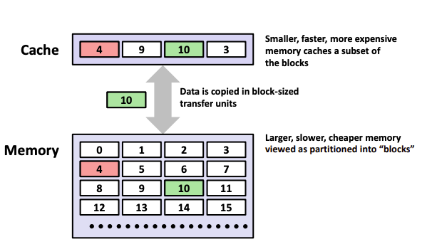

# CMU 15213 Cache Lab

Cache Lab 是 CSAPP 这门课程的第五个 Lab。

这个 Lab 总共分为了三个部分：

- 手写几个 Trace File 来满足缓存命中 / Miss 的次数要求
- 手写一个 LRU 缓存
- 优化矩阵转置算法

从难度上来看，前面两个部分的难度相对较低，而第三个部分则比较考验脑力，有种回到了 Data Lab 解 puzzle 的感觉。

在完成这个 Lab 之前，我们还是先来回忆一下 Cache 相关的知识。

# Cache Recap

## Memory Hierarchy


首先我们先来看一张非常经典的图，即内存的层级结构，一般来说越底层存储量越大、越便宜、但是访问也越慢，而相应的，越顶层的内存结构存储量越小、越昂贵、访问起来也越快速。

cache（缓存，台译快取）指的是一个小而快速的存储设备，它作为存储在更大、耶更慢的设备中的数据对象的缓冲区域。因此，在存储器的体系结构中，每个 k 层其实都可以视为 k + 1 层的设备的缓存。

另外，需要注意的是，数据是以 ***block-sized*** 作为单位从内存复制到 Cache 中的。



## Cache Structure

想象一个简单的场景，如果我们试图从主存中读取地址 A 对应的数据，那么我们其实遇到了两个问题。

- 我们怎么快速知道地址 A 对应的数据是否已经储存在 Cache 中了
- 如果地址 A 对应的数据没有被存储到 Cache 中，当我们要进行缓存的时候，我们怎么知道要缓存到 Cache 的哪个位置？

其实这两个问题的本质是一样的 —— 怎么快速根据目标数据在主存中的地址 A 定位到缓存的地址。

对于缓存而言，机器的高速缓存被组织成为一个有 S = 2 ^ s 个高速缓存组（cache set）的数组。

每一个缓存组包含了 E 个高速缓存行 cache line。

每个 cache line 包含了

- 1 位 valid bit —— 标志这一行是否被使用
- t 位 tag bit —— 形成一个 unique 的 tag
- B = 2 ^ b 位的 block —— 一个 B 字节的高速缓存块

假设我们计算机系统中每个存储器地址有 m 位，那么就可以形成 M = 2 ^ m 个不同的地址。

通过将这 m 位进行拆分，我们可以很轻松的得出该地址应该对应的缓存中的位置。更具体而言，我们将 m 分割成为 m = t + s + b

- 通过 s 我们可以知道指向哪一个 cache set （我们总共有 S = 2 ^ s 个 cache set）
- 遍历该 cache set 的每一个 cache line，比较 cache line 的 tag bits 是否和我们地址 A 的 t 位相对应
    - 如果某个 cache line 的 tag bits 和我们地址 A 的 t 位一致，则说明缓存命中
    - 否则缓存不命中
- 一旦上一步缓存命中了，那么 b 位的 block offset 可以告诉我们目标数据在 B 个字节的数据块中的偏移位置


## General Cache Concepts

缓存中最重要的概念是 Hit 和 Miss，而其中 Miss 又被分为三种: 1) Cold Miss. 2) Capacity Miss. 3) Conflict Miss.

Hit 非常好理解，就是我们试图请求 block 4 的时候，发现 block 4 已经存在于 Cache 中了，也就是***缓存命中***。

而三种 Miss 则稍微有一点迷惑。

- *Cold (Compulsory) Miss*
    - 冷不命中 / 强制不命中，主要是因为 cache 刚刚启动，因此里面是空的
- *Capacity Miss*
    - 容量不命中，当前的 working set 的数据量大于 cache size
- *Conflict Miss*
    - 缓存仍然有空间，但是因为 placement policy，导致 k + 1 层的数据 x 预期缓存到的位置上已经有了数据
    - 例如第 k + 1 层的 i 块，只能缓存到 k 层的 i mod 4 块，那么我们如果循环访问 8 4 0 8 4 0，那么每一次都会发生 conflict miss

然而，最好的方式还是结合一道练习题来理解

Consider the following sequence of 10 addresses requested in the order given. We already know

- 7 bits addresses
- 2-way set associative
- Total size: 16 bytes (not counting meta data)
- Block size: 4 bytes / block
- t = 4, b = 2, s = 1, E = 4

| Address | Tag | S | Offset | H/M | Type |
| --- | --- | --- | --- | --- | --- |
| 0x1 | 0000 | 0 | 00 | Miss | Cold |
| 0x2 | 0000 | 0 | 10 | Hit |  |
| 0x3A | 0111 | 0 | 10 | Miss | Cold |
| 0x21 | 0100 | 0 | 01 | Miss | Cold |
| 0x42 | 1000 | 0 | 10 | Miss | Cold |
| 0x5A | 1011 | 0 | 10 | Miss | Cold |
| 0x22 | 0100 | 0 | 10 | Miss | Conflict |
| 0x1 | 0000 | 0 | 01 | Miss | Capacity |
| 0x42 | 1000 | 0 | 10 | Miss | Conflict |
| 0x2A | 0101 | 0 | 10 | Miss | Cold |

在这个练习题中，我们可以得出几个结论

- 如果说某个 Tag 从未出现过，那么他第一次出现发生的 miss 一定是 ***cold miss***
- 如果说某个 Tag 出现过了，那么我们考虑一下 cache set 的容量，在这个题目中，一个 cache set 最多可以存储 2 条 cache lines，而我们可以有 2 个 cache set —— 因此整个缓存最多可以存储 4 个 cahce lines
    - 因此我们需要查看这个 Tag 往上的前四条数据，例如我们正在看 0x22 的话，就需要检查 0x5A - 0x3A 这四条数据
        - 如果这四条里面出现了 0x22 的 tag 0100，那么说明我们的 cache size 是够的，但是因为我们的算法问题，导致 0100 没有出现在现在的 cache set 中 —— ***conflict miss***
        - 如果这四条里面没有出现过 0100，说明我们的 cache size 不够 —— ***capacity miss***

# Lab 1 - **Writing Traces for a Cache Simulator**

一个相当简单的任务，要求我们自己写 Trace File，来达到要求的 hits misses 以及 eviction 次数。

这里是题目要求

| File Name | s | E | b | Requirements | Max Ops | Points |
| --- | --- | --- | --- | --- | --- | --- |
| tr1.trace | 3 | 1 | 4 | 2 hits, 1 eviction | 5 | 3 |
| tr2.trace | 1 | 3 | 4 | 2 hits, 2 misses | 5 | 3 |
| tr3.trace | 2 | 3 | 4 | 5 hits, 4 misses, 1 eviction | 10 | 4 |

以第一题为例子，要求我们发生 2 次 hits 和 1 次 eviction。

我们第一次 Load 0x00，此时的 tag = 0，set = 0，发生了一次 cold miss

我们第二次 Load 0x80，此时的 tag = 1，set = 0，因此和前一个数据指向同一个 cache set，又 E = 1，且此次数据的 tag 和前一次数据的不一样，因此会发生一次 eviction

第三次和第四次都 Load 0x80，发生两次 hits。

（剩余两题的思路都差不多，就不在这里赘述了）

```jsx
// tr1.trace
L 0,16
L 80,16
L 80,2
L 80,4

// tr2.trace
L 0,4
L 0,4
L 20,4
L 20,4

// tr3.trace
L 0,4
L 40,4
L 80,4
L c0,4
L c1,4
L c2,4
L c3,4
L c4,4
L c5,4
```

# Lab 2 - **Writing a Cache Simulator**

在这个任务中，我们需要写一个 cache simulator 来模拟 LRU cache 的运行。

没有太多好说的，只要掌握了上文关于缓存的讲解，接下来就是单纯的用 C 语言来实现。

# Lab 3 - O**ptimizing Matrix Transpose**

整个 Cache Lab 最难的一部分，也是最需要思考的一部分。在这个任务中，我们需要优化矩阵转置操作。题目会给予你缓存相关的参数(s E b)，以及矩阵的尺寸。

首先我们先思考为什么需要对矩阵转置进行优化。

假设我们要将矩阵 A 转置到矩阵 B 中，按照最朴素的思路，我们的代码可能类似于

```c
for (int i = 0; i < n; i++) 
	for (int j = 0; j < n; j++)
		A[i][j] = B[j][i];
```

那么我们每次访问的时候，发生的场景是

```c
A[0][0], cold miss
B[0][0], cold miss + conflict, evict A[0][0]

A[0][1], conflict miss, evict B[0][0]
B[1][0], cold miss

A[0][2], cache hit
B[2][0], cold miss

A[0][3], cache hit
B[3][0], cold miss

...
```

在上面的思路中，如果我们访问 B[1][0]，那么实际上缓存系统会将 B[1][0] ~ B[1][7] 都缓存起来，那么是否我们访问 B[1][1] 的时候就 cache hit 了呢？

答案是否定的，由于我们的缓存有大小限制，当你按照上面的代码逻辑访问到 B[1][1] 的时候，曾经缓存的 B[1][0] ~ B[1][7] 早被驱逐了，因此此时还是会存在一次新的 cache mis

所以，我们的目标是：**尽量减少 cache miss。**

实现的方案是：**将缓存到的内容尽可能的都使用后再驱逐。**(例如 B[1][0] ~ B[1][7] 我们希望只有访问 B[1][0] 的时候产生一次 miss，然后我们要将这 8 个 item 全部都使用完之后，再驱逐缓存)

更具体的代码实现就是使用**分页**的思想。

知道需要分页之后，可以直接写出 1024 * 1024 的优化方案

```c
static void trans_opt_1024(size_t M, size_t N, double A[N][M], double B[M][N],
                                double tmp[TMPCOUNT]) {
    assert(M > 0);
    assert(N > 0);

    // Traverse the matrix with a step size of 8
    for (size_t m = 0; m < M; m += 8) {
        for (size_t n = 0; n < N; n += 8) {
            // Divide the matrix into 8 * 8 block
            for (size_t i = m; i < m + 8; i++) {
                for (size_t j = n; j < n + 8; j++) {
                    B[j][i] = A[i][j];
                }
            }

        }
    }

    assert(is_transpose(M, N, A, B));
}
```

1024 * 1024 的优化还是相对简单的，因为题目给出的缓存大小也比较大。

32 * 32 的优化方案也是类似的，但是因为题目给的缓存大小较小，并且老师给的 benchmark 也比较严格，因此做了一步额外的优化。

针对对角线的元素，例如 A[0][0]，如果我们直接进行 B[0][0] = A[0][0]，由于 B[0][0] 和 A[0][0] 所在的 block 是一样的，就会产生额外的 eviction。当我们后后续读 A[0][1] 的时候，就造成了额外的缓存不命中。

我们的方案是，当访问 A[0][0] 的时候，我们先延迟 B[0][0] = A[0][0] 的操作。我们继续操作 B[1][0] = A[0][1], B[2][0] = A[0][2], … B[7][0] = A[0][7].

至此，A[0][0]～A[0][7] 我们只剩下 A[0][0] 没有处理了，我们此时再执行 B[0][0] = A[0][0] 的操作后，A[0][0]～A[0][7] 就全部被使用完了，因此也没有额外的缓存不命中。

```c
static void trans_opt_32(size_t M, size_t N, double A[N][M], double B[M][N],
                      double tmp[TMPCOUNT]) {
    assert(M > 0);
    assert(N > 0);

    // Traverse the matrix with a step size of 8
    for (size_t m = 0; m < M; m += 8) {
        for (size_t n = 0; n < N; n += 8) {
            // Divide the matrix into 8 * 8 block
            for (size_t i = m; i < m + 8; i++) {
                for (size_t j = n; j < n + 8; j++) {
                    if (m == n && i == j && i != n + 7) {
                        // In the diagonal, we will not copy A[i][i] to B[i][i]
                        // This will cause an extra eviction
                        // We delay this copy step to the future
                        continue;
                    }
                    B[j][i] = A[i][j];
                    if (m == n && j == n + 7 && i != n + 7) {
                        // In the diagonal and j == n + 7,
                        // means we needn't cache A[m][n] ~ A[m][n + 7] any more
                        // So we can call the copy operation
                        // and evict this cache line directly.
                        B[i][i] = A[i][i];
                    }
                }
            }
        }
    }

    assert(is_transpose(M, N, A, B));
}
```