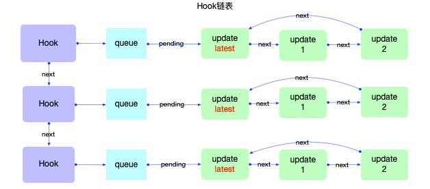
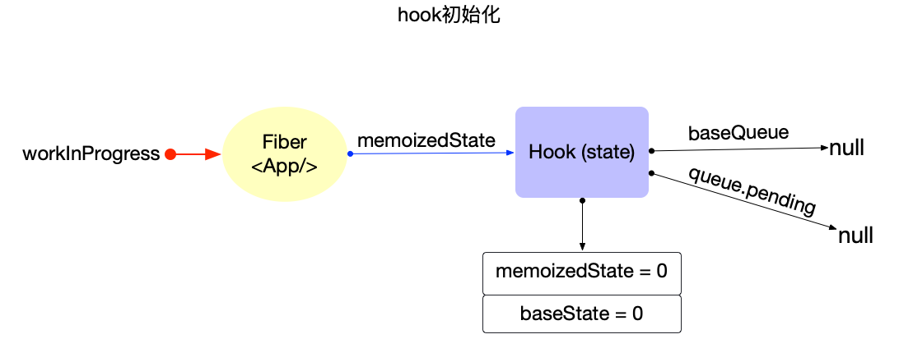
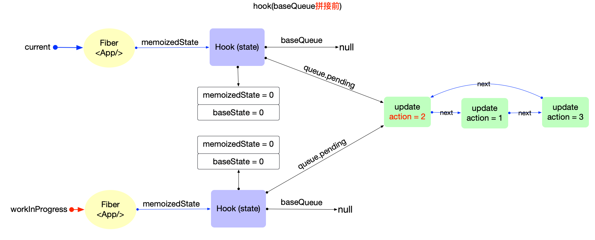
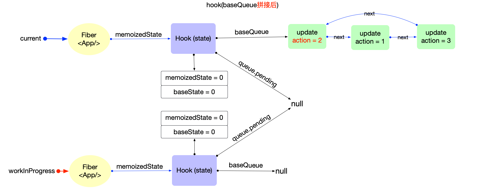

# React Hooks 原理 —— 状态 Hook

我们知道 React 组件最为常见的写法分为 Class 组件和 Function 组件。

在 Class 组件中，每一个组件都会被实例化成为一个 instance，通过实例化，其先天性的可以在多次渲染之间保留组件的状态变化。再后续的更新操作中，Class Component 只是调用 `render` 方法，因此实例中的信息不会丢失。

然而 Function 组件中，其不会被实例化，每次渲染或者更新都是单纯的直接调用这个 Function，所以函数组件中没有办法保存 state 等信息。那么我们怎么样保存组件的局部状态呢？—— 这就需要依赖 Hooks 来实现了。

 

***为什么需要 React Hooks？***

详细的内容可以参考官方文档 https://zh-hans.legacy.reactjs.org/docs/hooks-intro.html 

总结来说，React Hooks 有着以下的优点

- Hooks 是比 HOC 和 render props 更加优雅的逻辑复用方式
- Hooks 中 useEffect 取代了生命周期的概念，是一种更加清晰的心智模型
- Hooks 可以帮助我们进行逻辑切割 —— 不会让不相关的逻辑耦合在一起
    - 例如我们的组件每次更新的时候要做两件不相干的事情 —— 请求 API A，做一些处理 / 请求 API B，做一些处理
    - 曾经我们需要将这两段完全不相关的 code logic 写入到一个 `componentDidUpdate` 函数中
    - 现在我们可以将这两段不相关的 code logic 分别写入到一个 `useEffect` 里
- 函数式编程更加易于写 concurrent
    - React 内部可以维护很多份应用状态
    - 当 React 进行一次渲染的时候，会计算出组件树的新状态
    - 此时如果有另一个更高优先级的任务发生了，React 可以直接去处理高优先级任务，这个新算出来的状态不会有任何影响
    - 然而如果用的是 Class，那么每一个组件本质是一个共享的实例 instance，那么此时进行并发更新，就容易造成状态混乱

***为什么不建议使用 Class Component？***

- 除了以上的部分原因之外，Class Component 的 `this`, `bind` 方法的使用导致更重的心智负担
- Function Component 在被大多数现代打包工具打包的时候有更好的优化策略，打包产物的 JS Bundle Size 可以压缩的更小
- Hook 避免了 class 需要创建类实例以及构造函数中绑定事件处理器的额外开支
- Hook 往往可以避免 HOC 和 render props 中常见的深层嵌套 —— 使组件树更小

综上，React Hooks + Function Component 是经过大量实践后得出的维护性更强 + 性能更好 + 更加优雅的实践方案，是官方推荐我们使用的方案！

---

### 介绍

Hook 一般分为两个大类 —— 状态 Hook 和 副作用 Hook

- 状态 Hook —— 状态是一个静态的功能，为 Fiber 节点提供数据源，常见的状态 Hook 包括 `useState` / `useReducer`
- 副作用 Hook —— 副作用是一个动态的功能，在 Fiber 树渲染阶段的不同 phase 可能被调用，来执行其指定的某种操作。不同的副作用 Hook 被调用的时间不同，因此可以获得页面突变前快照、突变后的 DOM 节点等信息。常见的副作用 Hook 包括 `useEffect` / `useLayoutEffect`

本文中会先介绍状态 Hook 相关的源代码。再后续文章中会介绍副作用 Hook 相关的源代码。

在源代码中，执行 Function Component 的链路是 `beginWork` → `updateFunctionComponent` → `renderWithHooks`

### `renderWithHooks`

```tsx
export function renderWithHooks<Props, SecondArg>(
  current: Fiber | null,
  workInProgress: Fiber,
  Component: (p: Props, arg: SecondArg) => any,
  props: Props,
  secondArg: SecondArg,
  nextRenderLanes: Lanes,
): any {
  //* --------------- 1. 设置全局变量 -------------------
  renderLanes = nextRenderLanes; // 当前渲染优先级
  currentlyRenderingFiber = workInProgress; // 当前fiber节点, 也就是function组件对应的fiber节点
  // 如果是第一次渲染，然后调用了 Layout Effect，那么就会进入到 mountEffectImpl
  // 在其中我们会为 currentlyRenderingFiber.updateQueue 增添新的 effect

  if (__DEV__) {
    hookTypesDev =
      current !== null
        ? ((current._debugHookTypes: any): Array<HookType>)
        : null;
    hookTypesUpdateIndexDev = -1;
    // Used for hot reloading:
    ignorePreviousDependencies =
      current !== null && current.type !== workInProgress.type;
  }

  // 清除当前fiber的遗留状态
  workInProgress.memoizedState = null;
  workInProgress.updateQueue = null;
  workInProgress.lanes = NoLanes;

  //* --------------- 2. 调用function,生成子级ReactElement对象 -------------------

  if (__DEV__) {

  } else {
    //* 指定 dispatcher, 根据 Mount 和 Update 的不同，选择不同的 dispatcher
    ReactCurrentDispatcher.current =
      current === null || current.memoizedState === null
        ? HooksDispatcherOnMount
        : HooksDispatcherOnUpdate;
  }
  // 这里我们根据 mount 或者 update 的不同，指定了不同的 dispatcher
  // 在不同的 dispatcher 中，同样的 Hook 会调用不一样的函数
  // 例如 useState -> mountState(mount) | updateState(update)
  
  const shouldDoubleRenderDEV =
    __DEV__ &&
    debugRenderPhaseSideEffectsForStrictMode &&
    (workInProgress.mode & StrictLegacyMode) !== NoMode;

  shouldDoubleInvokeUserFnsInHooksDEV = shouldDoubleRenderDEV;

  // 我们输入的 Component 是编译后的 FunctionComponent
  //* 在这里执行function函数。如果我们的代码里有 useState 之类的 Hooks，那么就会在这一步中被调用
  let children = Component(props, secondArg);
  shouldDoubleInvokeUserFnsInHooksDEV = false;
  
  // Check if there was a render phase update
  if (didScheduleRenderPhaseUpdateDuringThisPass) {
    children = renderWithHooksAgain(
      workInProgress,
      Component,
      props,
      secondArg,
    );
  }

  if (shouldDoubleRenderDEV) {
    // In development, components are invoked twice to help detect side effects.
    setIsStrictModeForDevtools(true);
    try {
      children = renderWithHooksAgain(
        workInProgress,
        Component,
        props,
        secondArg,
      );
    } finally {
      setIsStrictModeForDevtools(false);
    }
  }
  //* --------------- 3. 重置全局变量,并返回 -------------------
  finishRenderingHooks(current, workInProgress);

  return children;
}
```

这个函数主要做了三件事情

1. 对 `ReactFiberHooks.js` 中的一些全局变量进行了初始化，包括 `currentlyRenderingFiber` 属性，让我们记录目前正在处理的是哪一个 Fiber 节点
2. 根据当前的组件是处于 mount 或者 update 阶段，选择不同的 dispatcher。在不同的 dispatcher 中，同样的 Hook 会调用不一样的函数。例如 `useState` -> `mountState`(mount) | `updateState`(update)
3. 执行 `*Component(props, secondArgs)`* 其中 Component 就是我们的这个函数式组件的被编译后的函数形式，在其中我们会调用 useState 等 Hook
4. 清空全局变量

### `mountState`

```tsx
// 对于 useState，如果是第一次被调用的话，就会内部转向调用 mountState 钩子
// 注意输入值 initialState 的类型是 (() => S) | S，也就是说 useState 的输入可以是一个函数，也可以是一个值
function mountState<S>(
  initialState: (() => S) | S,
): [S, Dispatch<BasicStateAction<S>>] {
  // 1. 创建 Hook
  const hook = mountWorkInProgressHook(); // 关键函数是这个！包括 mountEffectImpl 内部也调用了这个函数
  if (typeof initialState === 'function') {
    // $FlowFixMe[incompatible-use]: Flow doesn't like mixed types
    initialState = initialState();  // 如果输入是一个函数的话，则执行这个函数获得初始的值
  }

  // 2. 初始化 Hook 属性
  // 注意 memoizedState 保存了 state 的当前状态
  // baseState 是基础状态，作为合并 hook.baseQueue 的初始值
  hook.memoizedState = hook.baseState = initialState;     // 2.1 初始 hook.memoizedState 和 hook.baseState
  const queue: UpdateQueue<S, BasicStateAction<S>> = {    // 2.2 初始 hook.queue
    pending: null,
    lanes: NoLanes,
    dispatch: null,
    lastRenderedReducer: basicStateReducer,
    lastRenderedState: (initialState: any),
  };
  hook.queue = queue;
  const dispatch: Dispatch<BasicStateAction<S>> = (queue.dispatch =       // 2.3 初始 queue.dispatch
    (dispatchSetState.bind(null, currentlyRenderingFiber, queue): any));  // 因此，当我们调用 dispatch 的时候实际上是调用 dispatchSetState

  // 3. 返回 [当前状态，dispatch] -> const [count, setCount] = useState(0)
  return [hook.memoizedState, dispatch];  
}
```

对于 `useState` 来说，如果是在 mount 阶段被调用，就会走到 `mountState` 函数

1. 创建一个 Hook 对象
2. 初始化 Hook 对象的属性，包括 `hook.memoizedState`, `hook.baseState`, `hook.queue`, `hook.dispatch`
3. 返回  `[当前状态，dispatch]`

注意最后返回的格式是 `return [hook.memoizedState, dispatch];`

是不是与我们每次调用 `const [count, setCount] = useState(0);` 的写法非常相似！

### `mountWorkInProgressHook`

```tsx
// 非常单纯的函数，就是创建一个新的 Hook 对象，然后添加到链表中
function mountWorkInProgressHook(): Hook {

  // 创建一个 Hook 对象
  const hook: Hook = {
    memoizedState: null,

    baseState: null,
    baseQueue: null,
    queue: null,

    next: null, // 链表的 next 指针，指向下一个 Hook
  };

  if (workInProgressHook === null) {  // 如果这是当次渲染的第一个 Hook，那么将链表的头指向这个 Hook
    // This is the first hook in the list
    currentlyRenderingFiber.memoizedState = workInProgressHook = hook;
  } else {                            // 如果这不是当次渲染的第一个 Hook，那么在链表的尾部添加这个 Hook
    // Append to the end of the list
    workInProgressHook = workInProgressHook.next = hook;
  }
  return workInProgressHook;
}
```

其实就是创建一个 Hook 对象，然后添加到一个全局的链表之中。无论是你调用 `useState`, `useReducer`, `useEffect`, … ，这些函数的第一步永远都是调用 `mountWorkInProgressHook`

因此，在一个 Function Component Fiber 中，所有你调用过的 React Hooks 函数，都会被转换成一个个 Hook 对象，然后以链表的形式结合起来。





### `mountReducer`

```tsx
function mountReducer<S, I, A>(
  reducer: (S, A) => S,
  initialArg: I,
  init?: I => S,
): [S, Dispatch<A>] {
  // 1. 创建 Hook 并挂载到 Hooks 链表上
  const hook = mountWorkInProgressHook();
  let initialState;
  if (init !== undefined) {
    initialState = init(initialArg);
  } else {
    initialState = ((initialArg: any): S);
  }

  // 2. 初始化 Hook 属性
  hook.memoizedState = hook.baseState = initialState;
  const queue: UpdateQueue<S, A> = {
    pending: null,
    lanes: NoLanes,
    dispatch: null,
    // 与 useState 的主要区别就在于这里，useState 用的是 basicStateReducer, 
    // 而 useReducer 使用的是外部传入的自定义 reducer. 所以 useState 是最最简单的一种 useReducer
    lastRenderedReducer: reducer, 
    lastRenderedState: (initialState: any),
  };
  hook.queue = queue;

  // 3. 初始化 dispatch
  const dispatch: Dispatch<A> = (queue.dispatch = (dispatchReducerAction.bind(
    null,
    currentlyRenderingFiber,
    queue,
  ): any));
  return [hook.memoizedState, dispatch];
}
```

`useReducer` 函数在 mount 阶段会走到 `mountReducer`，和上文的 `mountState` 一对比，发现几乎没有区别！

唯一的区别就是，在 mountState 中，`queue.lastRenderedReducer = basicStateReducer`, basicStateReducer 是一个内置的函数

而在 mountReducer 中，`queue.lastRenderedReducer = reducer`, reducer 是用户输入的第一个参数

**因此，正如我们常说的，`useState` 是一种特殊的且更加简单的 `useReducer`**

`useState` 可以转换成 `useReducer`

```tsx
const [state, dispatch] = useState({ count: 0 });

// 等价于
const [state, dispatch] = useReducer(
  function basicStateReducer(state, action) {
    return typeof action === 'function' ? action(state) : action;
  },
  { count: 0 },
);

// 当需要更新state时, 有2种方式
dispatch({ count: 1 }); // 1.直接设置
dispatch((state) => ({ count: state.count + 1 })); // 2.通过回调函数设置
```

至此，mount 阶段已经处理完了。让我们进入到 update 阶段。

例如我们有这么一段代码 `const [count, setCount] = useState(0);`

那么当我们调用 `setCount(1)` 的时候会发生什么呢？本质上是调用了 `dispatchSetState` 函数（useReducer 的场景下调用的是 `dispatchReducerAction` 函数）

### `dispatchSetState`

```tsx
function dispatchSetState<S, A>(
  fiber: Fiber,
  queue: UpdateQueue<S, A>,
  action: A,
): void {

  const lane = requestUpdateLane(fiber);  // 返回一个 Lane

  // 创建 update 对象
  const update: Update<S, A> = {
    lane,
    action,
    hasEagerState: false,
    eagerState: null,
    next: (null: any),
  };

  if (isRenderPhaseUpdate(fiber)) {
    // 如果处于 render 过程中，将更新任务放入当前fiber的更新队列中
    enqueueRenderPhaseUpdate(queue, update);
  } else {
    const alternate = fiber.alternate;
    if (
      fiber.lanes === NoLanes &&
      (alternate === null || alternate.lanes === NoLanes)
    ) {
      // 目前的队列是空的，因此我们可以在 rendering phase 之前，立刻计算出下一个 state 的值
      // 如果新的 state 和当前的 state 相同，我们可以直接退出
      const lastRenderedReducer = queue.lastRenderedReducer;
      if (lastRenderedReducer !== null) {
        let prevDispatcher;
        try {
          const currentState: S = (queue.lastRenderedState: any);
          const eagerState = lastRenderedReducer(currentState, action);
          update.hasEagerState = true;
          update.eagerState = eagerState;
          if (is(eagerState, currentState)) {
            enqueueConcurrentHookUpdateAndEagerlyBailout(fiber, queue, update);
            return;
          }
        } catch (error) {
          // Suppress the error. It will throw again in the render phase.
        } finally {
        }
      }
    }

    const root = enqueueConcurrentHookUpdate(fiber, queue, update, lane);
    if (root !== null) {
      const eventTime = requestEventTime();
      scheduleUpdateOnFiber(root, fiber, lane, eventTime);  // 熟悉的味道... 发起调度更新
      entangleTransitionUpdate(root, queue, lane);
    }
  }

  markUpdateInDevTools(fiber, lane, action);
}
```

dispatchSetState 函数最主要的是创建一个 Update 对象，然后决定是否发起新的一轮的调度更新

1. 如果当前正处于 render phase，那么单纯的将这个 Update 对象加入到一个链表中，当 render phase 结束后，React 会处理链表中的任务
2. 如果不处于 render phase，那么我们可以开始执行这个更新任务 —— 但是这里进行了一个额外的性能优化！
    1. 我们可以根据当前的状态和用户的输入，立即计算出下一个 state 的值，并将其记录在 `update.eagerState` 中
    2. 如果新的 state 和 current state 是一样的，那么我们直接结束当前的函数，不发起调度更新
    3. 如果新的 state 和 current state 不同，那么我们最终会调用 scheduleUpdateOnFiber 发起调度更新，此时，我们又要经历一次这个链路 `beginWork` → `updateFunctionComponent` → `renderWithHooks`。只不过在 `renderWithHooks` 中，当我们运行 Function 的时候，`useState` 会被解析成 `updateState`; `useReducer` 会被解析成 `updateReducer`
    4. 在后续，当我们要计算 new state 的时候，由于已经记录在了 eagerState 中，因此也不会进行重复计算


### `dispatchReducerAction`

```tsx
function dispatchReducerAction<S, A>(
  fiber: Fiber,
  queue: UpdateQueue<S, A>,
  action: A,
): void {

  const lane = requestUpdateLane(fiber);

  const update: Update<S, A> = {
    lane,
    action,
    hasEagerState: false,
    eagerState: null,
    next: (null: any),
  };

  if (isRenderPhaseUpdate(fiber)) {
    enqueueRenderPhaseUpdate(queue, update);
  } else {
    const root = enqueueConcurrentHookUpdate(fiber, queue, update, lane);
    if (root !== null) {
      const eventTime = requestEventTime();
      scheduleUpdateOnFiber(root, fiber, lane, eventTime);  // 进入到 reconciler 中的 scheduleUpdateOnFiber 函数
      entangleTransitionUpdate(root, queue, lane);
    }
  }

  markUpdateInDevTools(fiber, lane, action);
}
```

dispatchReducerAction 和前文的 dispatchSetState 几乎一样，只是没有增加 eagerState 的性能优化 —— 因此，在某些场景下，useState 可能可以取得更好的性能

为什么 dispatchReducerAction 不增加关于 eagerState 的性能优化呢？因为 React 无法控制用户是如何声明自定义的 reducer function 的。

我们判断 eagerState 的时候，其实会有两种情况

1. 如果我们的状态更新函数类似于 `dispatch(100)` ，是更新到一个固定的值，那么我们直接比较 state 更新前后的 value 即可
2. 如果我们的状态更新函数类似于 `dispatch(oldState => oldState + 100)` ，传递的是一个 function，那么我们需要确保
    1. 这个 function 本身不改变
    2. state value 在经过这个 function 计算前后值也不改变

在 dispatchSetState 中，我们的状态更新函数实际上就是 `basicStateReducer` ，这是一个内置的函数，React 可以保障这个 function 本身是不变的。

但是当用户自定义 reducer 的时候，事情就会变的不确定起来

```tsx
function change(old) {
	return old + 100
}
function App1() {
  const [count, dispatch] = useState(0);
  return <button onClick={() => dispatch(change)}>点击</button>;
}

// ===============================
function App2() {
  const [count, dispatch] = useState(0);

	function change(old) {
		return old + 100
	}

  return <button onClick={() => dispatch(change)}>点击</button>;
}

```

在上面 App1 的写法中，是满足上述的两个要求的

然而在 App2 的写法中，由于每一次 App2 function 都会重新执行，因此每次生成的 function 都是一个新的 function，所以是不满足 eagerState 的条件的

因此，对于 useReducer 来说命中优化的不确定性是很高的！而这也导致了一些衍生的 Bug，由于暂时没有很好的处理方案，因此 React 团队先去除了 useReducer 中关于 eagerState 的性能优化

（https://juejin.cn/post/7220223630667726907）

### `updateState`

```tsx
function updateState<S>(
  initialState: (() => S) | S,
): [S, Dispatch<BasicStateAction<S>>] {
  return updateReducer(basicStateReducer, (initialState: any));
}
```

嗯…就是调用 `updateReducer`

### `updateReducer`

```tsx
function updateReducer<S, I, A>(
  reducer: (S, A) => S,
  initialArg: I,
  init?: I => S,
): [S, Dispatch<A>] {
  const hook = updateWorkInProgressHook();  // 关键函数 获取 workInProgressHook 对象，updateEffectImpl 中也会调用这个函数
  const queue = hook.queue;

  queue.lastRenderedReducer = reducer;  // 注意，useState 和 useReducer 的最大区别就在于 lastRenderedReducer 的不同

  const current: Hook = (currentHook: any);

  // 获取 baseQueue 和 pendingQueue，进行链表拼接
  // The last rebase update that is NOT part of the base state.
  let baseQueue = current.baseQueue;

  // The last pending update that hasn't been processed yet.
  const pendingQueue = queue.pending;
  if (pendingQueue !== null) {
    // We have new updates that haven't been processed yet.
    // We'll add them to the base queue.
    if (baseQueue !== null) {
      // Merge the pending queue and the base queue.
      const baseFirst = baseQueue.next;
      const pendingFirst = pendingQueue.next;
      baseQueue.next = pendingFirst;
      pendingQueue.next = baseFirst;
      // 合并 baseQueue 和 pendingQueue，baseQueue 在前，pendingQueue 在后
      // pendingQueue.next 指向环形链表的头节点
      // baseQueue.next 指向 pendingQueue 的头节点
    }

  // 状态计算
  if (baseQueue !== null) {
    // We have a queue to process.
    const first = baseQueue.next; // 此时也就指向了 baseQueue 的头节点
    let newState = current.baseState;

    let newBaseState = null;
    let newBaseQueueFirst = null;
    let newBaseQueueLast: Update<S, A> | null = null;
    let update = first;
    do {
      // An extra OffscreenLane bit is added to updates that were made to
      // a hidden tree, so that we can distinguish them from updates that were
      // already there when the tree was hidden.
      const updateLane = removeLanes(update.lane, OffscreenLane); // 从 update.lane 中移除 offscreenlane 的那一 bit
      const isHiddenUpdate = updateLane !== update.lane; // 如果 !== 成立，说明 update.lane 中包含了 offscreenlane 的那一 bit

      // Check if this update was made while the tree was hidden. If so, then
      // it's not a "base" update and we should disregard the extra base lanes
      // that were added to renderLanes when we entered the Offscreen tree.
      const shouldSkipUpdate = isHiddenUpdate
        ? !isSubsetOfLanes(getWorkInProgressRootRenderLanes(), updateLane)
        : !isSubsetOfLanes(renderLanes, updateLane);

      if (shouldSkipUpdate) {
        // 如果这个 update 对象的优先级不够，则先不执行，而是加入到下一次 render 的 Hook.baseQueue 中
        // 因此，Hook.baseQueue 存之前的优先级不够的 update 对象
        // Queue.pending 存当次 render 新创建的 update 对象

        // Priority is insufficient. Skip this update. If this is the first
        // skipped update, the previous update/state is the new base
        // update/state.
        const clone: Update<S, A> = {
          lane: updateLane,
          action: update.action,
          hasEagerState: update.hasEagerState,
          eagerState: update.eagerState,
          next: (null: any),
        };
        if (newBaseQueueLast === null) {
          newBaseQueueFirst = newBaseQueueLast = clone;
          newBaseState = newState;
        } else {
          newBaseQueueLast = newBaseQueueLast.next = clone;
        }
        // Update the remaining priority in the queue.
        // TODO: Don't need to accumulate this. Instead, we can remove
        // renderLanes from the original lanes.
        currentlyRenderingFiber.lanes = mergeLanes(
          currentlyRenderingFiber.lanes,
          updateLane,
        );
        markSkippedUpdateLanes(updateLane);
      } else {
        // This update does have sufficient priority.

        if (newBaseQueueLast !== null) {
          const clone: Update<S, A> = {
            // This update is going to be committed so we never want uncommit
            // it. Using NoLane works because 0 is a subset of all bitmasks, so
            // this will never be skipped by the check above.
            lane: NoLane,
            action: update.action,
            hasEagerState: update.hasEagerState,
            eagerState: update.eagerState,
            next: (null: any),
          };
          newBaseQueueLast = newBaseQueueLast.next = clone;
        }

        // Process this update.
        const action = update.action;
        if (shouldDoubleInvokeUserFnsInHooksDEV) {
          reducer(newState, action);
        }

        
        if (update.hasEagerState) {
          // 一个性能优化，如果存在 eagerState，直接使用 eagerState，不需要再计算一次 reducer 函数了
          // 在 dispatchSetState 中可能标记 update.hasEagerState 为 true

          // If this update is a state update (not a reducer) and was processed eagerly,
          // we can use the eagerly computed state
          newState = ((update.eagerState: any): S);
        } else {

          // 调用 reducer 函数，计算新的状态
          newState = reducer(newState, action);
        }
      }
      update = update.next; // update 指针往后推移，执行下一个 update
    } while (update !== null && update !== first);

    // 更新属性
    if (newBaseQueueLast === null) {
      newBaseState = newState;
    } else {
      newBaseQueueLast.next = (newBaseQueueFirst: any);
    }

    // Mark that the fiber performed work, but only if the new state is
    // different from the current state.
    if (!is(newState, hook.memoizedState)) {
      markWorkInProgressReceivedUpdate();
    }

    // 把计算之后的结果更新到workInProgressHook上
    hook.memoizedState = newState; // 计算完所有的高优先级任务后得到的 state
    hook.baseState = newBaseState; // 直到遇到第一个低优先级任务前计算得到的 state
    hook.baseQueue = newBaseQueueLast;

    queue.lastRenderedState = newState; // 因此 queue.lastRenderedState 记录最新的 state
  }

  if (baseQueue === null) {
    // `queue.lanes` is used for entangling transitions. We can set it back to
    // zero once the queue is empty.
    queue.lanes = NoLanes;
  }

  const dispatch: Dispatch<A> = (queue.dispatch: any);
  return [hook.memoizedState, dispatch];  // 返回的是 [最新的状态，原本的 dispatch 函数]
}
```

这是一个非常长的代码，但是其实可以划分成为三个部分

1. `const hook = updateWorkInProgressHook();` 如前文所说，每一个 React Hooks 函数都对应了一个 Hook 对象，`updateWorkInProgressHook` 则是帮助我们获取这个目标 Hook 对象
2. 合并 baseQueue 和 pendingQueue，pendingQueue.next 指向环状链表的头节点，baseQueue.next 指向 pendingQueue 的头节点
3. 执行合并后的 Queue 中的 update 对象

步骤 1 我们将在后面一节讲解

步骤 2 只是单纯的链表操作






步骤 3 的逻辑我们可以看到非常的复杂… React 为了支持并发执行，并不是一口气就执行完所有的 Update 对象的，它会根据每一个 Update 对象的优先级，先执行其中的一部分，然后再后续的 render 中再执行剩下的部分。

具体而言，假设我们有 update1, update2, update3, update4, update5 五个 Update 对象，其中 1 2 5 是高优先级的任务，3 4 是低优先级任务

那么这里的逻辑是

1. 首先正常计算 update1，得到 newState
2. 然后正常计算 update2，得到 newState
3. 计算到 update3 的时候，这是第一个低优先级任务，于是此时的 newState 变成了未来的 newBaseState，并且创建了一个新的链表 baseQueue，不会执行 update3 的计算逻辑
4. 计算到 update4 的时候，这仍然是低优先级任务，不会执行计算逻辑，直接加入到 baseQueue 中
5. 计算到 update5 的时候，尽管这是一个高优先级任务，但是此时 baseQueue 已经存在了，所以虽然会执行计算逻辑，得到 newState，但也会把 update5 丢进 baseQueue 中
6. 然后执行赋值 `Hook.memoizedState = newState`, `Hook.baseState = newBaseState`, `Hook.baseQueue = baseQueue`
    1. 其中 newState 经历了 update1 update2 update5 的计算
    2. newBaseState 经历了 update1 update2 的计算
    3. 因此 Hook.memoizedState 和 Hook.baseState 是不一致的
7. 在下一次 render 之前，我们会使用当前的 Hook.memoizedState 作为中间状态，来供给 React 使用
8. 在下一次 render 的过程中，我们基于 baseState 为起点（经历了 update1 update2 但是没有经历过 update3 4 5），继续执行这些逻辑
9. 最后，计算得到的 baseState 和 memoizedState 是一致的，尽管原始的优先级排序不是 1～5，但仍然确保最终计算出的 state 是按照 update 1 ~ 5 的顺序执行的

之所以要这样设计，是因为一方面我们希望高优先级任务尽早执行，所以在计算中间状态的时候，memoizedState 是经历了所有的高优先级任务的计算。

但是另一方面，我们希望我们按照 update 注册的顺序来执行，避免出现异常结果，所以在计算最终状态的时候，我们是沿着 newBaseState 按照 update 注册的顺序来执行的。

### `updateWorkInProgressHook`

```tsx
function updateWorkInProgressHook(): Hook {
  // 首先，这个函数在 update 或者 re-render 的时候被触发，因此我们希望根据之前构建的
  // current hook 或者 work-in-progress hook，来 clone 或者作为基础创建一个新的 hook 链表

  // 由于新的一次更新的时候入口应该是 renderWithHooks 函数，在里面有 currentlyRenderingFiber = workInProgressFiber
  // 那么 currentlyRenderingFiber.alternate 应该就是目前渲染在页面中的 current fiber
  // current.memoizedState 也就是上一次的 Hook 链表

  // 1. 移动 currentHook 指针
  let nextCurrentHook: null | Hook;
  if (currentHook === null) {
    const current = currentlyRenderingFiber.alternate;  // currentlyRenderingFiber 是 WIP 的 fiber，其 alternate 指向的是目前页面渲染了的 fiber
    if (current !== null) {
      nextCurrentHook = current.memoizedState;  // 此时 nextCurrentHook 指向上一次渲染的第一个 Hook
    } else {
      nextCurrentHook = null;
    }
  } else {
    nextCurrentHook = currentHook.next;
  }

  // 2. 移动 workInProgressHook 指针
  let nextWorkInProgressHook: null | Hook;
  if (workInProgressHook === null) {  // 注意，在 mount 阶段，workInProgressHook 总是指向 hook 链表的尾部
    nextWorkInProgressHook = currentlyRenderingFiber.memoizedState;
  } else {
    nextWorkInProgressHook = workInProgressHook.next;
  }

  if (nextWorkInProgressHook !== null) {
    //! 如果 nextWorkInProgressHook 不为 null，说明这应该是一次 re-render？
    // 我们要直接复用之前的 Hook 链表

    // There's already a work-in-progress. Reuse it.
    workInProgressHook = nextWorkInProgressHook;
    nextWorkInProgressHook = workInProgressHook.next;

    currentHook = nextCurrentHook;
  } else {
    // 如果 nextWorkInProgressHook 为 null，说明这是一个新的更新，那么我们需要 clone 之前的 Hook 链表
    // Clone from the current hook.

    if (nextCurrentHook === null) { // 不应该出现这种情况 —— 出现了的话报错
      const currentFiber = currentlyRenderingFiber.alternate;
      if (currentFiber === null) {
        // This is the initial render. This branch is reached when the component
        // suspends, resumes, then renders an additional hook.
        // Should never be reached because we should switch to the mount dispatcher first.
        throw new Error(
          'Update hook called on initial render. This is likely a bug in React. Please file an issue.',
        );
      } else {
        // This is an update. We should always have a current hook.
        throw new Error('Rendered more hooks than during the previous render.');
      }
    }

    // clone currentHook 作为新的 workInProgressHook
    // 随后的逻辑和 mountWorkInProgressHook 一样，单纯的将 Hook 加入到链表中
    currentHook = nextCurrentHook;

    // 直接复制了 currentHook 指向的 Hook 对象。因此前一次 Hook 中的状态不会丢失
    const newHook: Hook = {
      memoizedState: currentHook.memoizedState,

      baseState: currentHook.baseState,
      baseQueue: currentHook.baseQueue,
      queue: currentHook.queue,

      next: null,
    };

    if (workInProgressHook === null) {
      // This is the first hook in the list.
      currentlyRenderingFiber.memoizedState = workInProgressHook = newHook;
    } else {
      // Append to the end of the list.
      workInProgressHook = workInProgressHook.next = newHook;
    }
  }
  return workInProgressHook;
}
```

这个函数会沿着 Hook 链表访问我们的 Hook 对象，针对每一个 Hook 对象，会创建一个 newHook 来复制 currentHook 的属性。通过观察这个函数，解答了许多关于使用 React Hooks 的疑惑

1. **为什么 Hook 可以在不同的渲染之间保持状态呢？**
    1. 通过 clone 上一次渲染的 Hook 对象到 newHook 中，实现跨渲染的状态保存（因此，React Hooks 存储的那些属性永远在内存中）
2. **为什么 Hook 不能在 if 语句中使用？**
    1. 注意到，如果我们的 Function Component 中包含了 n 个 Hook，那么这个 Function 每次执行的时候，这 n 个 Hook 函数都会按顺序执行
    2. 当这 n 个 Hook 函数按顺序执行的时候，每一个 Hook Function 都会调用 `updateWorkInProgressHook`，于是我们的指针每一次都会沿着链表移动
    3. 因此，无论渲染多少次，我们的这个链表结构 / 顺序都是不会改变的 —— React 依赖于这种前后顺序，确保每一个 Hook Function 拿到的是正确的 Hook 对象
    4. 如果我们将 Hook Function 放置在 if 语句中，那么我们无法保证这种顺序上的一致性，因此 React 是不支持这样操作的！