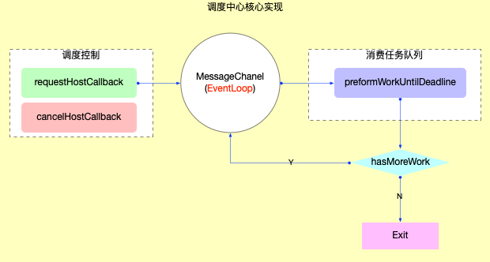

# React Scheduler 调度原理

从宏观角度，我们可以将 React 的核心部分细分为三个部分 React-DOM, React-Reconciler, 以及 React-Scheduler。

其中 React Scheduler 是我们实现可中断渲染的核心部分，这篇文章会通过观察 React 的源码，来了解到 Scheduler 是怎么调度任务的，以及 React 是怎么实现可中断渲染的。

React Scheduler 的代码主要出现在 `**react/packages/scheduler/src/forks/Scheduler.js**`

而入口则是 **`react/packages/react-reconciler/src/ReactFiberWorkLoop.js`** 中的 **`ensureRootIsScheduled`** 函数.

在 ensureRootIsScheduled 函数中，会调用

```jsx
newCallbackNode = scheduleCallback(
      schedulerPriorityLevel,
      performConcurrentWorkOnRoot.bind(null, root), // 这个函数作为 callback 函数丢到任务队列中
)
```

至此进入到 Scheduler 包中。

### `scheduleCallback()`

```jsx
// Reconciler 阶段通过这个 API 进入到 Scheduler 中
// unstable_scheduleCallback(ImmediateSchedulerPriority, flushSyncCallbacks) 
// 或者 unstable_scheduleCallback(..., performConcurrentWorkOnRoot)
// 第二个输入的这个 function，会作为 cb 属性来创建新的 task
function unstable_scheduleCallback(
  priorityLevel: PriorityLevel,
  callback: Callback,
  options?: {delay: number},
): Task {
  var currentTime = getCurrentTime();

  var startTime;
  if (typeof options === 'object' && options !== null) {
    var delay = options.delay;
    if (typeof delay === 'number' && delay > 0) {
      startTime = currentTime + delay;
    } else {
      startTime = currentTime;
    }
  } else {
    startTime = currentTime;
  }

  // 根据传入任务的优先级，设置任务的过期时间, 然后计算获得 expirationTime  
  var timeout;
  switch (priorityLevel) {
    case ImmediatePriority:
      timeout = IMMEDIATE_PRIORITY_TIMEOUT; // timeout = -1
      break;
    case UserBlockingPriority:
      timeout = USER_BLOCKING_PRIORITY_TIMEOUT;
      break;
    case IdlePriority:
      timeout = IDLE_PRIORITY_TIMEOUT;
      break;
    case LowPriority:
      timeout = LOW_PRIORITY_TIMEOUT;
      break;
    case NormalPriority:
    default:
      timeout = NORMAL_PRIORITY_TIMEOUT;
      break;
  }

  var expirationTime = startTime + timeout;

  // 创建一个 newTask 对象
  var newTask: Task = {
    id: taskIdCounter++,    // 一个自增的 taskId
    callback,               // 当前 task 传入的回调函数
    priorityLevel,          // 当前 task 的优先级
    startTime,              // 当前 task 的开始时间
    expirationTime,         // task 的过期时间 —— 优先级越高，startTime + tiemout = expirationTime 越小
    sortIndex: -1,          // task 在 taskQueue 中的排序索引 —— 过期时间越小 越紧急的任务排序在越前面
  };
  if (enableProfiling) {
    newTask.isQueued = false;
  }

  if (startTime > currentTime) {  // 如果是一个延迟任务
    // This is a delayed task.
    newTask.sortIndex = startTime;
    push(timerQueue, newTask);  // 注意，这里是将 task 放入 timerQueue 中
    if (peek(taskQueue) === null && newTask === peek(timerQueue)) {
      // 如果当前 taskQueue 已经为空了，并且这个新注册的任务是 timerQueue 中最早的
      // All tasks are delayed, and this is the task with the earliest delay.
      if (isHostTimeoutScheduled) {
        // Cancel an existing timeout.
        cancelHostTimeout();
      } else {
        isHostTimeoutScheduled = true;
      }
      // Schedule a timeout. // 那么就在设定的延迟之后执行 timerQueue 中的任务
      requestHostTimeout(handleTimeout, startTime - currentTime);
    }
  } else {
    newTask.sortIndex = expirationTime;
    push(taskQueue, newTask); // 向小顶堆 taskQueue 中添加新的任务
    if (enableProfiling) {
      markTaskStart(newTask, currentTime);
      newTask.isQueued = true;
    }
    // Schedule a host callback, if needed. If we're already performing work,
    // wait until the next time we yield.
    // 将任务注册进来的时候，就会请求进行调度 —— 但是有可能调度后立刻执行的不是当前新创建的任务，而是之前的任务
    if (!isHostCallbackScheduled && !isPerformingWork) {
      isHostCallbackScheduled = true;
      requestHostCallback(flushWork);
    }
  }

  return newTask;
}
```

该函数是 Scheduler 包给予外界的入口函数，通过调用这个函数，我们会创建一个新的 Task 对象，如果说这个 Task 是一个延迟任务，那么我们会将其放入到 TimerQueue 中，如果这个 Task 是一个立即任务，我们会将其放入到 TaskQueue 中。

TaskQueue 和 TimerQueue 是 Scheduler 包维护的两个全局小顶堆，TaskQueue 保存的是需要立刻开始执行的任务，而 TimerQueue 保存的是已经注册了但是需要在未来执行的任务。

在做完了这一切后，我们会开始调用 `requestHostCallback(flushWork)` 进行任务的执行。其中 `flushWork` 是 Scheduler 包中的一个函数，我们会在后续讲解。

### `requestHostCallback`

```jsx
function requestHostCallback(
  callback: (hasTimeRemaining: boolean, initialTime: number) => boolean,
) {
  // 1. 保存回调函数 一般就是 flushWork
  scheduledHostCallback = callback;
  if (!isMessageLoopRunning) {
    isMessageLoopRunning = true;
    // 2. 通过 setImmediate / MessageChannel / setTimeout 发送消息
    schedulePerformWorkUntilDeadline();
  }
}
```

主要干了两件事情

1. 设置全局变量 `scheduleHostCallback = flushWork` 函数
2. 如果当前没有任务正在执行，那么调用 `schedulePerformWorkUntilDeadline` 函数开始尝试执行任务

### `schedulePerformWorkUntilDeadline`

```jsx
let schedulePerformWorkUntilDeadline;
// 如果原生支持 setImmediate，那么首选使用 setImmediate
// 但是如果不支持，那么再考虑使用 MessageChannel
// 如果都不支持，那么就使用 setTimeout
if (typeof localSetImmediate === 'function') {
  // Node.js and old IE.
  // There's a few reasons for why we prefer setImmediate.
  //
  // Unlike MessageChannel, it doesn't prevent a Node.js process from exiting.
  // (Even though this is a DOM fork of the Scheduler, you could get here
  // with a mix of Node.js 15+, which has a MessageChannel, and jsdom.)
  // https://github.com/facebook/react/issues/20756
  //
  // But also, it runs earlier which is the semantic we want.
  // If other browsers ever implement it, it's better to use it.
  // Although both of these would be inferior to native scheduling.
  schedulePerformWorkUntilDeadline = () => {
    localSetImmediate(performWorkUntilDeadline);
  };
} else if (typeof MessageChannel !== 'undefined') { // 浏览器环境自带的 MessageChannel class，这是一个 宏任务
  // DOM and Worker environments.
  // We prefer MessageChannel because of the 4ms setTimeout clamping.
  const channel = new MessageChannel();
  const port = channel.port2;
  channel.port1.onmessage = performWorkUntilDeadline;
  schedulePerformWorkUntilDeadline = () => {
    port.postMessage(null);
  };
} else {
  // We should only fallback here in non-browser environments.
  schedulePerformWorkUntilDeadline = () => {
    // $FlowFixMe[not-a-function] nullable value
    localSetTimeout(performWorkUntilDeadline, 0);
  };
}
```

`schedulePerformWorkUntilDeadline` 函数试图调用 `performWorkUntilDeadline` 函数。如果代码执行环境支持 `setImmediate`，那么首选使用 `setImmediate`；但是如果不支持，那么再考虑使用 `MessageChannel`；如果都不支持，那么就使用 `setTimeout`。

用于浏览器都是不支持 `setImmediate` 的，因此 web 环境下一般会使用 `MessageChannel` 或者 `setTimeout` —— 因此是在下一个***宏任务***中调度 `performWorkUntilDeadline` 函数

（这里的宏任务是一个重点！）

### `performWorkUntilDeadline`

```jsx
performWorkUntilDeadline = () => {
  if (scheduledHostCallback !== null) {   // scheduledHostCallback 是一个回调函数，只有通过 requestHostCallback 方法来进行设置
    const currentTime = getCurrentTime(); // 获取当前的时间
    // Keep track of the start time so we can measure how long the main thread
    // has been blocked.
    startTime = currentTime;  // 保存当前时间 —— 因此可以知道主线程被阻塞了多久
    const hasTimeRemaining = true;

    // If a scheduler task throws, exit the current browser task so the
    // error can be observed.
    //
    // Intentionally not using a try-catch, since that makes some debugging
    // techniques harder. Instead, if `scheduledHostCallback` errors, then
    // `hasMoreWork` will remain true, and we'll continue the work loop.
    let hasMoreWork = true;
    try {
      // $FlowFixMe[not-a-function] found when upgrading Flow
      hasMoreWork = scheduledHostCallback(hasTimeRemaining, currentTime);
    } finally {
      if (hasMoreWork) {
        // If there's more work, schedule the next message event at the end
        // of the preceding one.
        // 如果还有任务，那么就在当前任务结束后，调度一个新的任务
        schedulePerformWorkUntilDeadline();
      } else {
        // 如果没有更多的任务了，那么就将 scheduledHostCallback 置为 null
        isMessageLoopRunning = false;
        scheduledHostCallback = null;
      }
    }
  } else {
    isMessageLoopRunning = false;
  }
  // Yielding to the browser will give it a chance to paint, so we can
  // reset this.
  needsPaint = false; // 由于将控制权转移给浏览器后将会执行渲染操作，因此这里我们可以重置开关
};
```

核心就是判断当前主线程被阻塞的时间，然后不断的调用 `scheduledHostCallback` （也就是 `flushWork`） 函数来处理任务。`scheduledHostCallback` 函数会返回一个 bool 值，告诉我们是否还有更多的任务待完成。如果是的话，那么我们会再一次调用 `schedulePerformWorkUntilDeadline` 函数，进而`performWorkUntilDeadline` 注册到下一次的宏任务中。

### `flushWork`

```jsx
function flushWork(hasTimeRemaining: boolean, initialTime: number) {
  // 1. 做好 isHostCallbackScheduled 和 isPerformingWork 的标记，表示已经记录调度阶段
  if (enableProfiling) {
    markSchedulerUnsuspended(initialTime);
  }

  // We'll need a host callback the next time work is scheduled.
  isHostCallbackScheduled = false;
  if (isHostTimeoutScheduled) {
    // We scheduled a timeout but it's no longer needed. Cancel it.
    isHostTimeoutScheduled = false;
    cancelHostTimeout();
  }

  isPerformingWork = true;
  const previousPriorityLevel = currentPriorityLevel;
  try {
    if (enableProfiling) {
      try {
        // 2. 循环消费队列中的任务
        return workLoop(hasTimeRemaining, initialTime);
      } catch (error) {
        if (currentTask !== null) {
          const currentTime = getCurrentTime();
          // $FlowFixMe[incompatible-call] found when upgrading Flow
          markTaskErrored(currentTask, currentTime);
          // $FlowFixMe[incompatible-use] found when upgrading Flow
          currentTask.isQueued = false;
        }
        throw error;
      }
    } else {
      // No catch in prod code path.
      return workLoop(hasTimeRemaining, initialTime);
    }
  } finally { // 注意，尽管上面的 try catch 语句中有 return，但是 finally 语句块中的代码还是会执行
    // 3. 重置全局标记
    currentTask = null;
    currentPriorityLevel = previousPriorityLevel;
    isPerformingWork = false;
    if (enableProfiling) {
      const currentTime = getCurrentTime();
      markSchedulerSuspended(currentTime);
    }
  }
}
```

代码一大堆，说白了就是处理一些全局变量，然后调用 `workLoop` 函数

### `workLoop`

```jsx
function workLoop(hasTimeRemaining: boolean, initialTime: number) {
  let currentTime = initialTime;    // 保存当前时间，用来判断任务是否过期
  advanceTimers(currentTime);       // 根据当前的时间，将 TimerQueue 中的任务转移一部分到 TaskQueue
  currentTask = peek(taskQueue);    // 获取队列中的第一个任务（最紧急的任务）

  /**
   * 关注一下 while 循环的结束条件
   *     1. 情况一. 队列被完全清空 —— 所有任务一气呵成的被消费完了，没有任何阻碍
   *     2. 情况二. 执行超时
   */
  while (
    currentTask !== null &&
    !(enableSchedulerDebugging && isSchedulerPaused)
  ) {
    if (
      currentTask.expirationTime > currentTime &&
      (!hasTimeRemaining || shouldYieldToHost())
    ) {
      // 尽管当前的任务还没有过期，但是由于当前的任务已经执行了一段时间，所以需要将控制权交还给主线程
      // 此时，出了 while 循环后，在函数最后面的 if 逻辑中，肯定会走到 return true 的分支，表示还有任务需要执行
      // This currentTask hasn't expired, and we've reached the deadline.
      break;
    }
    const callback = currentTask.callback; // 外界传进来的 callback 函数
    if (typeof callback === 'function') {
      currentTask.callback = null;  // 将 callback 属性变成 null —— 表示任务已经被执行了
      currentPriorityLevel = currentTask.priorityLevel;
      const didUserCallbackTimeout = currentTask.expirationTime <= currentTime;
      if (enableProfiling) {
        // $FlowFixMe[incompatible-call] found when upgrading Flow
        markTaskRun(currentTask, currentTime);
      }
      // 执行 task.callback 函数
      // 其中 performConcurrentWorkOnRoot 就会以 callback 函数的形式被执行
      const continuationCallback = callback(didUserCallbackTimeout);
      currentTime = getCurrentTime();
      // 回调执行结束，判断是否还有派生的回调任务
      if (typeof continuationCallback === 'function') {
        //* 如果 continuationCallback === function，说明当前 callback 产生了连续的回调
        //* 那么就保留这个回调到 currentTask 中，然后 return true，告知还有更多的任务需要执行
        currentTask.callback = continuationCallback;    // 如果产生了连续的回调，那么就保留 currentTask，将 callback 属性变成新的回调函数
        if (enableProfiling) {
          // $FlowFixMe[incompatible-call] found when upgrading Flow
          markTaskYield(currentTask, currentTime);
        }
        advanceTimers(currentTime);
        return true; // 因为产生了新的回调，所以需要 return true，告知还有任务需要执行
      } else {
        //* 说明当前任务没有产生新的回调，可以将 currentTask 出队
        if (enableProfiling) {
          // $FlowFixMe[incompatible-call] found when upgrading Flow
          markTaskCompleted(currentTask, currentTime);
          // $FlowFixMe[incompatible-use] found when upgrading Flow
          currentTask.isQueued = false;
        }
        // 如果没有产生新的回调，那么就将 currentTask 出队
        if (currentTask === peek(taskQueue)) {
          pop(taskQueue);
        }
        advanceTimers(currentTime);
      }
    } else {
      // 如果传入的 callback 不是一个函数，那么就直接将 currentTask 出队
      pop(taskQueue);
    }
    // 继续获得当前队列中的第一个任务，继续 while 循环
    currentTask = peek(taskQueue);
  }

  // Return whether there's additional work
  if (currentTask !== null) {
    return true;    // 如果task队列没有清空, 返回true. 等待调度中心下一次回调
  } else {
    const firstTimer = peek(timerQueue);
    if (firstTimer !== null) {
      requestHostTimeout(handleTimeout, firstTimer.startTime - currentTime);
    }
    return false;   // task队列已经清空, 返回false.
  }
}
```

真正的执行任务的函数！

1. 这个函数返回一个 bool 值，告诉前一级是否 hasMoreWork
2. 进入这个函数的时候，调用 `advanceTimers`，基于当前时间，将一部分 TimerQueue 中的任务转移到 TaskQueue 中。
3. 有一个 while 循环，不断从 TaskQueue 的堆顶获取当前最紧迫的任务开始执行它的 callback 函数，例如我们在 ensureRootIsScheduled 函数注册的 `performConcurrentWorkOnRoot` 函数
    1. `performConcurrentWorkOnRoot` 函数中会进行 fiber 树的 update 以及 commit 等（因此是一个很大的过程～）
4. 如果当前执行的任务产生了一个 function 作为结果，那么直接返回 true，告知还有 more work 需要完成
5. 如果当前执行的任务结束后没有产生一个 function 作为结果，那么就可以将 currentTask 出列，表示这个任务执行完毕了，然后再访问当前 currentTask 的最新堆顶元素，持续 while 循环
6. 每次 while 循环的时候都会调用 `shouldYieldToHost` 函数，判断我们是否已经占用了浏览器太多的时间，是否需要将线程控制权还给渲染线程。

执行这个函数，最终产生的结果是

1. 要么我们一口气将队列中的任务全部清空，那么返回 false，表明没有 more work 了
2. 要么我们中途产生了新的任务 / 中途决定需要归还控制权给浏览器，那么返回 true，表明还有 more work。于是我们会在下一次宏任务中注册 `performWorkUntilDeadline`，然后重新回到 `workLoop` 函数清理任务

### `shouldYieldToHost`

```jsx
// 根据当前占用的时间，判断是否需要让出控制权给主线程
//  true -> 让出控制权
//  false -> 不让出控制权
function shouldYieldToHost(): boolean {
  const timeElapsed = getCurrentTime() - startTime;
  if (timeElapsed < frameInterval) {    // 如果当前时间小于时间切片周期, 则不需要让出控制权
    // The main thread has only been blocked for a really short amount of time;
    // smaller than a single frame. Don't yield yet.
    return false;
  }

  // 主线程被阻塞了较长一段时间，可以让出控制权给主线程
  // 但是注意到主线程中最重要的任务就是 UI 渲染（paint）和 处理用户输入（input）
  // 因此，这里采用了一个分级判断 ——
  //    1. 如果有 paint 任务，那么我们要很快的让出控制权
  //    2. 如果有 distinct input 任务，我们可以占用更久的控制权 (t < continuousInputInterval)
  //    3. 如果只有 continuous input 任务，我们可以接着占用更久的控制权 (t < maxInterval)
  //    4. 如果已经占用了 maxInterval 的控制权，那么无论如何都要让出控制权

  if (enableIsInputPending) {
    if (needsPaint) {   // 如果有需要执行的 paint 任务，就直接让出控制权
      // There's a pending paint (signaled by `requestPaint`). Yield now.
      return true;
    }
    if (timeElapsed < continuousInputInterval) {    
      // 如果堵塞的时间小于 continuousInputInterval 那么判断一下是否有需要执行的 discrete input 任务 (例如 click)
      // 如果主线程只有 mouseover 这种 continuous input，那么无所谓，不用让出控制权

      if (isInputPending !== null) {
        return isInputPending();
      }
    } else if (timeElapsed < maxInterval) {   
      // 如果堵塞时间小于 maxInterval 但是多于 continuousInputInterval，那么就算只有 continuous input，也应该让出控制权了

      if (isInputPending !== null) {
        return isInputPending(continuousOptions);
      }
    } else {
      // 我们已经阻塞主线程太久的时间了，就算主线程没有需要执行的 paint 或者 input 任务，也应该让出控制权了
      // 因为可能有一些类似于 network event 的任务需要执行

      return true;
    }
  }

  // `isInputPending` isn't available. Yield now.
  return true;
}
```

本质上我们会根据

1. 我们目前占用的线程时间长度
2. 当前浏览器是否存在待处理的渲染任务 / 独立任务 / 连续任务…

来决定我们是否应该继续占有线程。

### 一些问题

***这样的调度架构为什么实现了可中断渲染？***

可中断渲染的本质目的是，我们希望浏览器执行一段时间的 JS 代码，然后暂停下 JS 代码的执行，然后渲染页面，然后继续执行 JS 代码。我们希望通过可中断渲染的方式给予用户更加流畅和不掉帧的体验。

实际上，在浏览器的每一个渲染周期，它会干的事情是

`执行一个宏任务 - 清空微任务队列 - 执行一个宏任务 - 清空微任务队列 … - ***浏览器渲染*** - 执行一个宏任务 - …`  

而在浏览器真正的渲染之前，会确保当前的微任务队列已经完全清空了 —— 也就是说，如果我们在微任务队列中调度了一个计算复杂型的任务，是非常有可能导致浏览器渲染卡顿的。

当我们关注源代码的时候，我们会发现我们实际上是在不断调用 **`schedulePerformWorkUntilDeadline`** 函数，而在浏览器场景下，由于我们没有 setImmediate，因此这个函数的本质是使用 MessageChannel 或者 setTimeout 调用 **`performWorkUntilDeadline`**，因此会把任务给调度到下一个宏任务中。

这就给予了一个缺口，让浏览器可以执行 render 任务。渲染结束后，我们继续执行 `**performWorkUntilDeadline**` 来继续完成我们的任务。

反过来，想象一下，如果我们永远把 **`performWorkUntilDeadline`** 函数注册到微任务队列中，那么浏览器在渲染前还需要不断的清空微任务队列，那么实际上还是得处理完所有的任务，才能进行页面渲染。

***在哪些地方 JS 线程让出了控制权？它们又怎样帮助实现了可中断渲染？***

```jsx
// ReactFiberWorkLoop.js

function workLoopConcurrent() {
  // Perform work until Scheduler asks us to yield
  while (workInProgress !== null && !shouldYield()) { //* shouldYield() 函数来自于 Scheuler.js, 是核心的判断！
    // $FlowFixMe[incompatible-call] found when upgrading Flow
    performUnitOfWork(workInProgress);
  }
}
```

```jsx
// Scheduler.js
function workLoop(hasTimeRemaining: boolean, initialTime: number) {

  while (
    currentTask !== null &&
    !(enableSchedulerDebugging && isSchedulerPaused)
  ) {
    if (
      currentTask.expirationTime > currentTime &&
      (!hasTimeRemaining || shouldYieldToHost())
    ) {
      break;
    }
		// ... ...
    } 
  }

}
```

主要在两个地方会判断是否需要让出控制权，一个在 `ReactFiberWorkLoop.js` 的 `workLoopConcurrent` 函数中，一个在 `Scheduler.js` 的 `workLoop` 函数中。

`workLoop` 函数中，我们是在 Task 与 Task 之间进行判断，如果判断需要让出控制权，那么我们会中断 JS 线程 —— 因此避免任务太多导致的长时间占用

`workLoopConcurrent` 函数中，我们是在处理每一个 Fiber 节点之间进行判断，因此粒度比上文更加细小 —— 避免单一任务太久导致的长时间占用（例如 `performConcurrentWorkOnRoot` 有时候要遍历整个 Fiber 树，因此就是一个很长时间的过程！）

