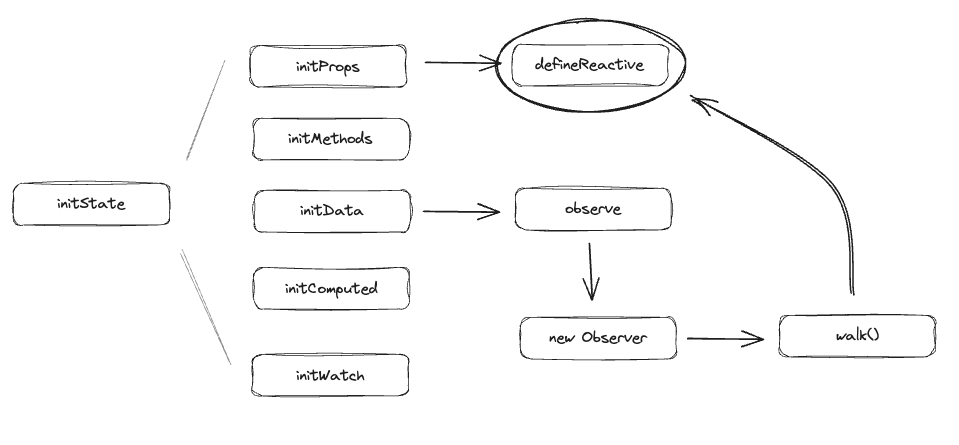
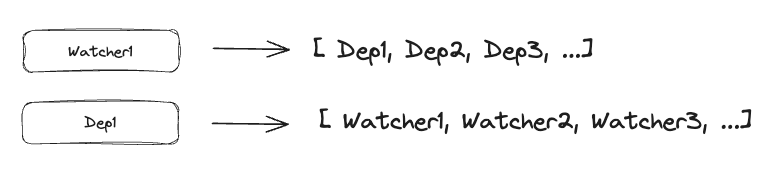
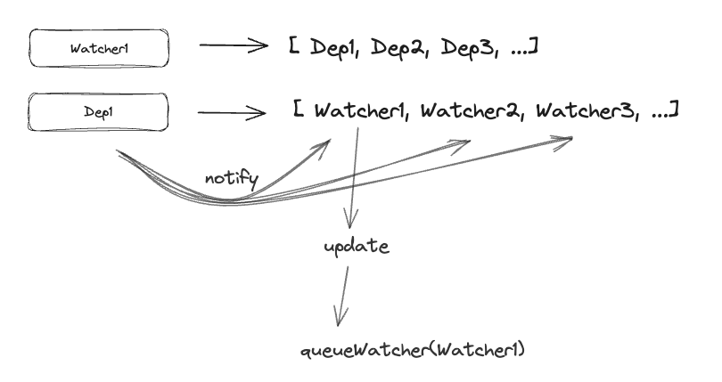

# Vue2 源码解析 —— 响应式原理

## 什么是响应式？

我们知道 Vue 的一个核心就是***响应式系统***。  
例如我们的页面中有这么一部分代码 `<div>{{ name }}</div>`，当我们的 name 的值改变的时候，视图会自动的进行更新。这就是所谓的响应式系统。

Vue 2 和 Vue 3 对响应式的实现略有不同，这篇文章将会从源代码的角度开始讨论在 Vue 2 中，我们是怎么实现响应式的。




## 响应式入口 `initState`

在 Vue 实例初始化的过程中，会执行一个 `initState` 函数，这个函数位于 `/src/core/instance/state.js` 中。  
这个函数是数据响应式的入口，依次调用 `initProps` `initMethods` `initData` `initComputed` `initWatch` 方法，完成 props methods data computed watch 属性的响应式处理

```JavaScript
/**
 * 两件事：
 *   数据响应式的入口：分别处理 props、methods、data、computed、watch
 *   优先级：props、methods、data、computed 对象中的属性不能出现重复，优先级和列出顺序一致
 *         其中 computed 中的 key 不能和 props、data 中的 key 重复，methods 不影响
 */
export function initState (vm: Component) {
  vm._watchers = []
  const opts = vm.$options  
  if (opts.props) initProps(vm, opts.props) // 1. 对props配置做响应式处理 2. 代理props配置上的key到vue实例，支持this.propsKey的方式访问
  if (opts.methods) initMethods(vm, opts.methods) // 1. 判重处理 methods中属性和props中属性不可重复 2. 支持this.methodsKey的方式访问
  if (opts.data) {
    initData(vm) // 1. 判重处理 2. 代理 将data中属性代理到vue实例，支持this.key的方式访问 3. 响应式处理
  } else {
    // 如果不存在opts.data 那么直接调用observe函数去监测一个空对象
    observe(vm._data = {}, true /* asRootData */)
  }
  if (opts.computed) initComputed(vm, opts.computed) 
  // 1. computed是通过watcher来实现的 对每一个computedKey实例化一个watcher，默认懒执行
  // 2. 将computedKey代理到vue实例上 支持通过this.computedKey的方式访问computedKey属性
  // 3. 注意理解computed缓存的实现原理

  // 核心：实例化一个watcher实例 并且返回一个unwatch
  if (opts.watch && opts.watch !== nativeWatch) { // 这里判断的时候要注意不能是浏览器原生的watch
    // 1. 处理watch对象
    // 2. 为每一个watch.key 创建 watcher实例，key和watcher实例可能是一对多的关系
    // 3. 如果设置了immediate 则立即执行回调函数
    initWatch(vm, opts.watch)
  }
}
```

接下来，我们就看看这些函数分别做了什么吧～

## initProps

```JavaScript
// 处理 props 对象，为 props 对象的每个属性设置响应式，并将其代理到 vm 实例上
// 这里触发响应式的方案是 defineReactive(props, key, value)
function initProps (vm: Component, propsOptions: Object) {
  const propsData = vm.$options.propsData || {}
  const props = vm._props = {}
  // 缓存props中的每一个key 来进行性能优化
  const keys = vm.$options._propKeys = []
  const isRoot = !vm.$parent

  if (!isRoot) {
    toggleObserving(false)
  }
  for (const key in propsOptions) {
    keys.push(key) // 缓存key
    const value = validateProp(key, propsOptions, propsData, vm)

    // 对props数据进行响应式处理
    defineReactive(props, key, value)
    
    // 处理 this.propsKey
    if (!(key in vm)) {
      // 代理key到vm对象上 --> 可允许用户通过 this.keyName 直接访问这个key
      proxy(vm, `_props`, key)
    }
  }
  toggleObserving(true)
}
```

在这里，我们去掉了一部分不重要的代码，整个 initProps 方法的核心其实就是两个函数，`defineReactive` 和 `proxy`，这两个函数我们会在后文讲解，在这里我们可以对其有一个大致的印象～
- `defineReactive`: 响应式设置的真正核心。`Object.defineProperty` 都在这里这个方法中定义。
- `proxy`: 将当前的 key 代理到 Vue 实例上，例如原本我们需要通过 `this._props.keyName` 访问的数据，现在可以直接通过 `this.keyName` 访问了

## initMethods

```JavaScript
/**
 * 做了以下三件事，其实最关键的就是第三件事情
 *   1、校验 methoss[key]，必须是一个函数
 *   2、判重
 *         methods 中的 key 不能和 props 中的 key 相同
 *         methos 中的 key 与 Vue 实例上已有的方法重叠，一般是一些内置方法，比如以 $ 和 _ 开头的方法
 *   3、将 methods[key] 放到 vm 实例上，得到 vm[key] = methods[key]，可以直接通过 this.methodName 访问这个 method
 */
function initMethods (vm: Component, methods: Object) {
  const props = vm.$options.props
  // 判重处理 methods中的key不能和props中的key重复。props中key的优先级更高
  for (const key in methods) {
    if (process.env.NODE_ENV !== 'production') {
      if (typeof methods[key] !== 'function') {
        warn(
          `Method "${key}" has type "${typeof methods[key]}" in the component definition. ` +
          `Did you reference the function correctly?`,
          vm
        )
      }
      if (props && hasOwn(props, key)) {
        warn(
          `Method "${key}" has already been defined as a prop.`,
          vm
        )
      }
      if ((key in vm) && isReserved(key)) {
        warn(
          `Method "${key}" conflicts with an existing Vue instance method. ` +
          `Avoid defining component methods that start with _ or $.`
        )
      }
    }
    // 将method中所有方法赋值到vue实例中，支持通过this.menthodKeys的方式访问定义的方法
    vm[key] = typeof methods[key] !== 'function' ? noop : bind(methods[key], vm)
  }
}
```

## initData

```JavaScript
/**
 * 做了三件事
 *   1、判重处理，data 对象上的属性不能和 props、methods 对象上的属性相同
 *   2、代理 data 对象上的属性到 vm 实例
 *   3、为 data 对象的上数据设置响应式 
 *      -> observe(data, true)
 */
function initData (vm: Component) {
  let data = vm.$options.data
  // 保证后续处理的data是一个对象
  // 其实 vm.$options.data 在mergeOptions的时候已经被处理成了一个函数了，但是这里为什么还要判断一次呢？
  // 因为在mergeOption和这一步initData之间还存在beforeCreated这一步，这一步有可能对vm.$options.data进行修改，因此这里还是要加一下类型判断的～
  data = vm._data = typeof data === 'function'
    ? getData(data, vm)
    : data || {}
  // 如果data还不是一个对象，就会返回一个空对象 然后给出警告
  if (!isPlainObject(data)) {
    data = {}
    process.env.NODE_ENV !== 'production' && warn(
      'data functions should return an object:\n' +
      'https://vuejs.org/v2/guide/components.html#data-Must-Be-a-Function',
      vm
    )
  }

  // proxy data on instance
  const keys = Object.keys(data)
  const props = vm.$options.props
  const methods = vm.$options.methods
  let i = keys.length
  while (i--) {
    const key = keys[i]
    // 判重处理 data中的属性不能和props和methods中的key重复
    if (process.env.NODE_ENV !== 'production') {
      if (methods && hasOwn(methods, key)) {
        warn(
          `Method "${key}" has already been defined as a data property.`,
          vm
        )
      }
    }

    if (props && hasOwn(props, key)) {
      process.env.NODE_ENV !== 'production' && warn(
        `The data property "${key}" is already declared as a prop. ` +
        `Use prop default value instead.`,
        vm
      )
    } else if (!isReserved(key)) {
      // 如果与props 和 methods中的key都没有重复 并且这个key也不是保留字
      // 代理data的属性到vue实例 支持通过this.key来进行访问
      proxy(vm, `_data`, key)
    }
  }
  // observe data
  observe(data, true /* asRootData */)
}
```

在这里我们又看到了第三个关键的函数 `observe`（前面两个是 `proxy` 和 `defineReactive`），这个函数也是为数据设置响应式的，那么它和前文的 `defineReactive` 又是什么关系呢？


## `proxy`

```JavaScript
const sharedPropertyDefinition = {
  enumerable: true,
  configurable: true,
  get: noop,
  set: noop
}

// 代理函数，将 key 代理到 vue 实例上
export function proxy (target: Object, sourceKey: string, key: string) {
  sharedPropertyDefinition.get = function proxyGetter () {
    return this[sourceKey][key]
  }
  sharedPropertyDefinition.set = function proxySetter (val) {
    this[sourceKey][key] = val
  }
  // 拦截对 this.key 的访问。 sharedPropertyDefinition定义了getter和setter
  Object.defineProperty(target, key, sharedPropertyDefinition)
}
```

proxy 其实就是一个非常直观的代理函数，通过使用 `Obejct.defineProperty` 来重写 `getter` 和 `setter`，让我们可以通过 `this[keyName]` 直接访问到我们需要的属性

## `observe`
```js
export function observe (value: any, asRootData: ?boolean): Observer | void {
  // 如果 value 是一个 VNode 实例，或者 value 是一个值类型，那么就不需要做响应式处理，直接返回
  if (!isObject(value) || value instanceof VNode) {
    return
  }
  console.log('observe', value, shouldObserve)
  let ob: Observer | void
  // 判断value是否已经有__ob__属性，如果有的话那么代表已经经历过响应式处理了，直接返回之前处理的结果就好啦
  if (hasOwn(value, '__ob__') && value.__ob__ instanceof Observer) {
    ob = value.__ob__
  } else if (
    shouldObserve && // 还记得前面经常调用的toggleObserve嘛？这个方法就会影响shouldObserve的值
    !isServerRendering() &&
    (Array.isArray(value) || isPlainObject(value)) &&
    Object.isExtensible(value) &&
    !value._isVue
  ) {
    // value没有做过响应式处理 那我们去处理一波吧！
    ob = new Observer(value)
  }
  if (asRootData && ob) {
    ob.vmCount++ // 注意到，只有 initData 触发的 obersever 会传入第二个参数 asRootData，所以这里的 vmCount 只会在根数据上增加
  }
  return ob
}
```
observe 方法的核心目的是创建一个 **`Observer`** 对象，每一个 **`Observer`** 对象都会包含一个 **`Dep`** 对象，然后执行 `walk` 方法或者 `observeArray` 方法，这些方法的尽头都是调用 `defineReactive` 方法

## `defineReactive`

```js

// 真正处理响应式的核心
/**
 * 拦截 obj[key] 的读取和设置操作：
 *   1、在第一次读取时收集依赖，比如执行 render 函数生成虚拟 DOM 时会有读取操作
 *   2、在更新时设置新值并通知依赖更新
 */
export function defineReactive (
  obj: Object,
  key: string,
  val: any,
  customSetter?: ?Function,
  shallow?: boolean
) {

  // 实例化一个dep 每一个key都对应一个dep
  const dep = new Dep()

  // 获取 obj[key] 的属性描述符，发现它是不可配置对象的话直接 return
  const property = Object.getOwnPropertyDescriptor(obj, key)
  if (property && property.configurable === false) {
    return
  }

  // cater for pre-defined getter/setters
  // 记录 getter 和 setter，获取 val 值
  const getter = property && property.get
  const setter = property && property.set
  if ((!getter || setter) && arguments.length === 2) {
    val = obj[key]
  }

  // 通过递归的方式处理value为对象的情况，即处理嵌套对象，保证对象中所有的key都被成功观察
  let childOb = !shallow && observe(val) // 你看这里有调用到observe函数！！！！！
  // Object.defineProperty 拦截obj[key]的访问和设置 
  Object.defineProperty(obj, key, {
    enumerable: true,
    configurable: true,
    get: function reactiveGetter () {
      const value = getter ? getter.call(obj) : val
      /**
       * Dep.target 为 Dep 类的一个静态属性，值为 watcher，在实例化 Watcher 时会被设置
       * 实例化 Watcher 时会执行 new Watcher 时传递的回调函数（computed 除外，因为它懒执行）
       * 而回调函数中如果有 vm.key 的读取行为，则会触发这里的 读取 拦截，进行依赖收集
       * 回调函数执行完以后又会将 Dep.target 设置为 null，避免这里重复收集依赖
       */

      // Dep.target 中保存的值就是要被收集的依赖(观察者）
      if (Dep.target) {
        // 读取时进行一个依赖收集 将dep添加到watcher中 也将watcher添加到dep中
        // 很好理解 一个地方get了这个data[key]的话，这个地方必定依赖data[key]，因此把自己也给加入到data[key]的dep.subs中
        dep.depend()
        if (childOb) {
          // 对嵌套对象也进行一个依赖收集 -- 为什么不让嵌套对象的依赖收集发生在自己的 get 函数中？不让它自己触发自己的 dep.depend()?
          // 因为我们的页面可能试图 get 了一个 obj，但是没有 get 其内部的嵌套对象，这样的情况下，嵌套对象的 getter 就不会触发
          // 然而，此时如果修改嵌套对象的值，也得触发响应式，因此必须在这里进行添加
          childOb.dep.depend()
          if (Array.isArray(value)) {
            // 处理为数组时的依赖收集
            dependArray(value)
          }
        }
      }
      return value
    },
    // set拦截 obj[key] = value 操作
    set: function reactiveSetter (newVal) {
      // 首先获取老的value
      const value = getter ? getter.call(obj) : val
      /* eslint-disable no-self-compare */
      if (newVal === value || (newVal !== newVal && value !== value)) {
        // 如果新老value相同 则不做处理
        return
      }
      /* eslint-enable no-self-compare */
      if (process.env.NODE_ENV !== 'production' && customSetter) {
        customSetter()
      }
      // #7981: for accessor properties without setter
      if (getter && !setter) return // 如果只有getter没有setter 说明是readonly的 也不做处理
      if (setter) {
        // 使用新的value替换老值
        setter.call(obj, newVal)
      } else {
        val = newVal
      }
      // 对新的val进行响应式处理 -> 也就是说如果 set 的值是一个新对象，则再进行一次响应式处理，重写这个对象的 setter 和 getter
      childOb = !shallow && observe(newVal)
      // 当响应式数据更新时 做依赖通知更新 --> 针对上面收集到的所有watcher 执行这些watcher自己的update方法 进入到异步更新阶段
      // dep.notify 会针对 dep.subs() 中的每一项都触发 watcher.update()，视图重新渲染
      dep.notify()
    }
  })
}
```
在 `defineReactive` 方法中，我们会为所有的 `obj[key]` 都创建一个 **Dep** 对象，然后使用 `Object.defineProperty` 来重写对象的 getter 和 setter
- getter: 在 getter 中调用 dep.depend() 来触发依赖收集
- setter: 在 setter 中调用 dep.notify() 来进行以来更新
 
## `dep.depend()`

```js
// dep.js
depend () {
    // 依赖收集 dep.target实际上是一个watcher
    if (Dep.target) {
      Dep.target.addDep(this)
    }
  }

// watcher.js
  /**
   * Add a dependency to this directive.
   * 两件事：
   *   1、添加 dep 给自己（watcher）
   *   2、添加自己（watcher）到 dep
   */
  // 说白了 newDepIds（第一个if）是为了避免一次请求中重复多次收集依赖
  // depIds（第二个if）是为了避免多次求值中重复收集依赖
  addDep (dep: Dep) {
    const id = dep.id
    // 将dep放到watcher中 如果dep已经存在了则不重复添加
    if (!this.newDepIds.has(id)) {
      this.newDepIds.add(id)
      this.newDeps.push(dep)
      // 避免在 dep 中重复添加 watcher，this.depIds 的设置在 cleanupDeps 方法中
      if (!this.depIds.has(id)) {
        // 将Dep.target这个watcher自己放到dep.subs中 实现了一个双向收集
        dep.addSub(this)
      }
    }
  }
```
当我们触发了一个属性的 getter 的时候，就会自动调用依赖收集函数。可以简单的理解成我们当前页面的渲染依赖于这个属性的值。（那么显然，如果后续这个属性的值变化了，我们的页面也需要重新渲染）
Dep.target 是一个全局的 **Watcher** 对象，他会维护一个叫做 `deps` 的 Dep Object 数组，记录自己监听了哪些属性。
同时，对于每一个 **Dep** 对象，他也会维护一个叫做 `subs` 的 Watcher Object 数组，这样的话，每一个 Dep 对象都知道有哪些 watcher 监听了自己的更新。


## `dep.notify()`
```js
  /**
   * 通知 dep 中的所有 watcher，执行 watcher.update() 方法
   */
  notify () {
    // stabilize the subscriber list first
    const subs = this.subs.slice()
    if (process.env.NODE_ENV !== 'production' && !config.async) {
      // subs aren't sorted in scheduler if not running async
      // we need to sort them now to make sure they fire in correct
      // order
      subs.sort((a, b) => a.id - b.id)
    }

    // 遍历当前dep收集到的所有watcher 让这些watcher依次执行update方法
    for (let i = 0, l = subs.length; i < l; i++) {
      subs[i].update()
    }
  }
```
当我们触发了一个属性的 setter 方法的时候，就会触发依赖更新函数。由于在依赖收集的过程中，我们的 Dep 属性已经知道了哪些 Watcher 监听自己了，因此我们此时就可以精准的告诉那些 Watcher 你需要触发自己的 `update` 方法，来对于属性的变更作出一定的响应了 —— 例如 render watcher，它做出的响应就是会重新生成 vDOM 然后重新渲染页面，也就是我们所说的页面响应式。


## 总结

### Question 1. Vue2 是怎样实现响应式的？

Vue2 的响应式本质上就是通过 `Object.defineProperty` 来拦截并且重写 getter 和 setter 的。然而，这个方案有很多不可避免的缺陷，因此在 Vue3 中被 `Proxy` 给替代了。
- 不支持数组的 push, pop, slice 等方法：对于数组而言，这些基本方法都没有办法被 getter 和 setter 拦截，因此 Vue2 的源代码里面重写了这些方法
- bad case 1: 如果我们原先的 object 是 `{name: 'kk'}`，现在我直接增加一个属性 `obj.age = 18`，不幸的是，这个 age 属性是无法被监听的！（必须通过 `this.$set(obj, age, 18)` 才能监听）
- bad case 2: 同样的，如果我是一个数组 `arr`，我直接使用索引修改数组的值 `arr[0] = 1`，也是无法被监听的，仍然需要使用 `$set` 方法
- **性能损失**: 注意到 getter 中有一行代码 `let childOb = !shallow && observe(val)`，这是一个递归操作，当你的 val 是一个对象的时候，会不断的进行依赖收集。因此，当你的 val 嵌套严重的时候，会有一个较大的性能损失。

### Question 2. Dep 和 Watcher？

对于每一个属性，它都有一个属于自己的 Dep 对象，Dep 是英文 dependency 依赖的缩写，一个 Dep 可能对应多个 Watchers。也就是说有多个不同的 Watchers 依赖于某个属性 Dep。当这个属性改变的时候，这些 Watchers 也会随之改变。
常见的 Watchers 有三种，一种是程序员声明的 watcher，一种是 computed 计算属性生成的 watcher，还有一种就是 Vue 最一开始的渲染阶段就会生成的 **Render Watcher**

### Question 3. Render Watcher?

首先，我们的代码会执行 initState。在这个阶段我们只是声明了每一个属性的 getter 和 setter。但是我们没有触发任何一个 getter！
然后，当源代码执行到 $mount 的时候，会创建一个 Render Watcher，在创建这个 Render Watcher 的时候，它的 get 函数会被触发，此时会尝试渲染页面。
当我们的代码尝试渲染页面的时候，显然就会试图获取页面上的属性的值，因此前面声明的这些 getter 才会被触发，于是每一个属性对应的 Dep 对象就记录了有一个 Render Watcher 监听了它。
当任意一个属性改变的时候，就会调用 `Dep.notify()`，进而调用 Render Watcher 的更新函数，导致页面的重渲染 —— 也就是页面响应式。