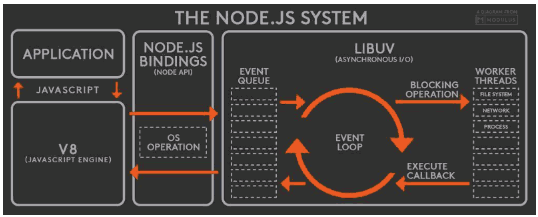
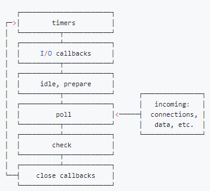

# Node.js 事件循环

> 面试题：浏览器和 Node.js 的事件循环有什么区别？

上面这个问题是一个非常经典的面试题。  
这篇文章会以这个面试题为起点，讲解浏览器的事件循环以及 Node.js 的事件循环


## 浏览器内核

当我们使用浏览器的时候，*每打开一个 Tab 其实就是打开了一个进程*，这个进程下面的多个线程相互配合，一个浏览器通常包含这些线程

- **GUI 渲染线程：**
    - 主要负责页面的渲染，解析HTML、CSS，构建DOM树，布局和绘制等。
    - 回流或者重绘的时候，执行该线程
    - 该线程与 JS 线程互斥
- **JS 引擎线程：**
    - 负责处理 JS 脚本，执行代码
    - 与 GUI 渲染线程互斥，因此当 JS 脚本执行时间过长，会导致页面渲染的阻塞
- **定时触发器线程**:
    - 负责执行异步定时器一类的函数的线程，例如 setTimeout, setInterval
    - 主线程顺序执行代码的时候，遇到定时器代码，会将定时器交给该线程处理进行计数，计数完毕后，事件触发线程会将计数完毕后的事件加入到任务队列的尾部，等待 JS 引擎线程执行
- **事件触发线程**:
    - 主要负责将准备好的事件交给 JS 引擎线程执行
    - 比如 setTimeout 定时器计数结束后 / AJAX 等异步请求成功并触发 callback function / 用户触发点击事件时，该线程会将这些事件给加到任务队列的队尾，等待 JS 线程执行
- **异步 http 请求线程**:
    - 负责执行异步请求一类的函数的线程，如： Promise，axios，ajax等
    - 主线程依次执行代码时，遇到异步请求，会将函数交给该线程处理，当监听到状态码变更，如果有回调函数，事件触发线程会将回调函数加入到任务队列的尾部，等待JS引擎线程执行

通过上文的描述可以看到，定时触发器线程、事件触发线程、异步请求线程最后干的事情都是将一个任务放到浏览器任务队列的队尾，等待 JS 线程执行

由此可见浏览器的事件循环说白了就是 macrotask 和 microtask 来回切换，每一轮循环中，***执行一个 macrotask***，等执行结束后，***清空 microtask 队列***中所有的微任务，然后再进入下一个事件循环

```jsx
console.log('start')
setTimeout(() => {
  console.log('timer1')
  Promise.resolve().then(function() {
    console.log('promise1')
  })
}, 0)
setTimeout(() => {
  console.log('timer2')
  Promise.resolve().then(function() {
    console.log('promise2')
  })
}, 0)
Promise.resolve().then(function() {
  console.log('promise3')
})
console.log('end')
```

在浏览器环境中，最终输出是 `start end promise3 timer1 promise1 timer2 promise2`

然而，在 Node 环境中，输出是 `start end promise3 timer1 timer2 promise1 promise2` 

为什么会这样呢！

## Node 中的 EventLoop

Node.js 采用 V8 作为 js 的解析引擎，在 IO 方面使用了自己设计的 libuv，封装了不同操作系统一些底层的特性，并且对外提供统一的 API，事件循环机制也是在 libuv 中实现。



Node.js 的运行机制如下

- V8引擎解析JavaScript脚本。
- 解析后的代码，调用Node API。
- libuv库负责Node API的执行。它将不同的任务分配给不同的线程，形成一个Event Loop（事件循环），以异步的方式将任务的执行结果返回给V8引擎。
- V8引擎再将结果返回给用户。

而事件循环分为6个阶段，每一个阶段都保留一个 FIFO 的回调队列，当进入到任意一个阶段的时候，都会从对应的回调队列取出函数来执行 —— 当队列为空或者执行的函数数量到达系统设定的阈值，就会进入下一个阶段

- **timers**: 执行 timer (setTimeout, setInterval) 回调
- **I/O calbacks**: 处理上一轮循环中未执行的 I/O 回调
- **idle, prepare**: node 内部使用
- **poll**: 获取新的I/O事件, 适当的条件下node将阻塞在这里
- **check**: 执行 setImmediate() 回调
- **close callbacks**: 执行 socket 的 close 事件回调



### timers

- 事件循环的入口，所有的同步代码执行完后，Node.js 进入到事件循环，此时访问的第一个 phase 就是 timers phase
- timers 会执行 setInterval setTimeout 声明的回调函数，但是需要注意的是，用户声明的运行时间并不一定是这个函数准确的运行时间。例如我声明了运行时间是 100ms，那么 100ms 后，我会尽可能快的执行这个 callback，但是由于我可能被堵塞在 poll 阶段，因此实际执行的时候可能会有延迟（超过 100ms）

### poll

- 如果进入到 poll 阶段，poll queue 不为空，则会同步执行里面的任务
- 如果 poll queue 为空
    - 如果代码中调度过了 `setImmediate()` 那么 poll 阶段直接结束，进入到 check 阶段，然后执行 `setImmediate()`
    - 如果代码中没有调度过 `setImmediate()`，eventLoop 会在 poll 阶段等待一段时间，如果有新的输入的回调函数，那么会立即执行
    - 如果在 poll 队列为空，等待的过程中，有 timers 达到了可以执行的阈值，那么会直接结束 poll 阶段，然后直接跳到 timers 阶段

### check

check 阶段的主要作用就是执行 `setImmediate()`。说白了 setImmediate 就是一个特殊的 timer，它单独的存在于事件循环的一个阶段。

一般来说，当代码运行的时候，event loop 最终会停留在 poll 阶段，等待新的 connection、request、data 等。但是，如果任意一个 callback 调度了 **setImmediate()** 且 poll phase 空闲了，那么就会进入到 check 阶段，而不是继续等待

### `setTimeout` ve `setImmediate`

其实 setImmediate 就是一个更加特殊的 timer，那么二者谁会先执行呢？

如果二者都在主模块里

```jsx
setTimeout(() => console.log("setTimeout"), 0)
setImmediate(() => console.log("setImmediate"))
```

那么执行的***先后顺序不一定***！

- 首先，`setTimeout(fn, 0)` 会被 Node.js 强制转换成 `setTimeout(fn, 1)` ***[浏览器中是 `setTimeout(fn, 4)`]***
- **而 Node.js 的执行流程是，外层的同步代码一次性执行完，遇到异步 API 塞到对应的阶段中。执行完同步代码后，*以 timers 阶段为入口，进入到 eventloop***
- 因此，如果进入到 eventloop 的时候，已经用时了 1ms 及以上，那么 timers queue 不为空，因此会先输出 setTimeout；否则，先输出 setImmediate

但是，如果已经进入了 eventloop 呢？

```jsx
var fs = require('fs')

fs.readFile(__filename, () => {
    setTimeout(() => {
        console.log('setTimeout');
    }, 0);
    setImmediate(() => {
        console.log('setImmediate');
    });
});
```

此时一定是先执行 setImmediate 的！

- readFile 是一个 IO 操作，它本身位于 poll 阶段
- 因此 setTimeout 被放在了 timers 阶段，setImmediate 在 check 阶段
- 会先执行 check 阶段的内容

另外，想要提到的一点是，如果你在 setTimeout 函数里面增加了一个新的 setTimeout(fn2)，那么这个 fn2 是会被放在下一次 timers phase 里进行处理的。同理，你在 setImmediate 里面增加一个 setImmediate，新的 setImmediate 内容也是会在下一次 check 阶段处理。

### `process.nextTick()`

这个函数独立于 event loop 之外，有自己的队列。当每个阶段结束后，如果存在 nextTick 队列，就会清空队列中的所有回调函数，并且 nextTick 中的回调函数优先于其他的 microtask 执行

## 总结 —— Node.js 与浏览器的差异

浏览器中是每处理一个 macrotask，就要清空所有的 microtask 队列中的 microtask

而 node 中是每处理完一个阶段的 macrotask，再去清空所有的 microtask 队列中的 microtask

这就是上面的例子中差别的原因，Node.js 里面要把 timers 阶段中多个回调函数都处理完了，再去处理 microtask

**但是，这个特性在 node 11 版本后被改了一下**！

node 11 之后，node 的表现与浏览器一致，也是每个 macrotask (setTimeout setInterval setImmediate) 处理完了，就检查一次 microtask