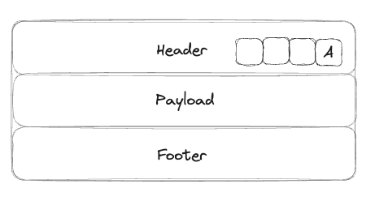
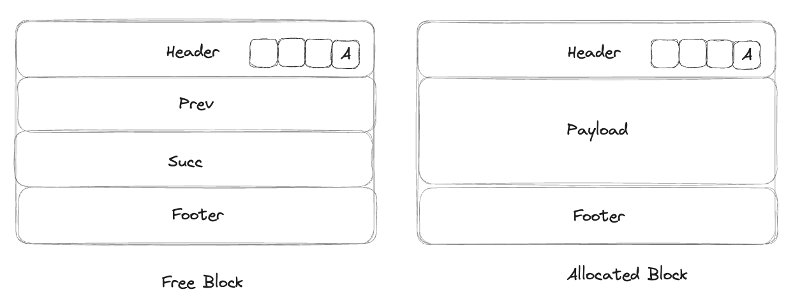
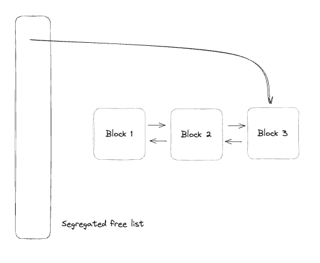
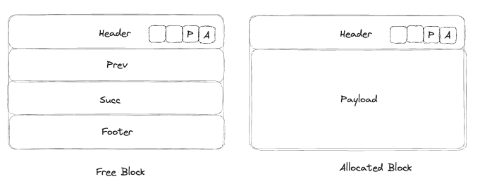
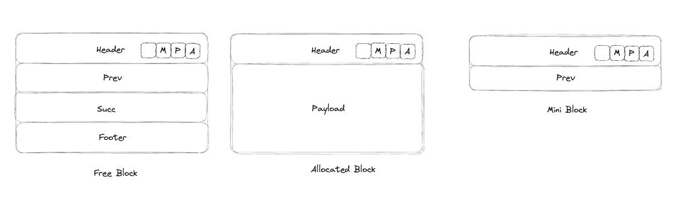

# 15213 - Malloc Lab Roadmap

在这个 Lab 中要求我们自己实现 C 语言中的 Malloc 函数和 Free 函数的功能。

要想知道这为什么会是一个困难的问题，我们需要先了解几个基本的概念

### Constraints for allocator

Allocator 有如下这些严格的限制

- 用户可能请求任何 size 的 block
- 需要立即对 malloc 请求进行响应（因此你不能 reorder 多个请求）
- 必须从 free memory 中分配内存，不同的 allocated block 之间不应该有重合
- 每一个 allocated block 必须满足对齐要求 (alignment requirement, e.g. 16-bytes alignment)
- 如果一个 block 已经被分配了，你不能后续的对其进行移动等操作

### Target

在如此多的限制条件下，分配器试图实现***吞吐率最大化***和***内存使用率最大化***，然而这两个性能目标通常是相冲突的

- **Throughput**
    - 我们单位时间内可以处理的请求数量
- **Memory Utilization**
    - 内存利用率其实最常用的是峰值利用率 peak utilization
    - malloc 操作后我们的 Heap 会变大，我们假设 Heap 大小是一个**单调递增**的 —— 因为就算你 free 操作也不会让 Heap 变小
    - 我们希望当前的 有效载荷 / 总 Heap Size 尽可能的大

### External Fragment and Internal Fragment

造成 Heap 利用率低的主要原因是 Fragmentation

- ***Internal Fragmentation***
    - 为了满足字节对齐条件所形成的碎片，例如我只请求 3 byte 的空间，但是我要求 16 byte 对齐，那么我真实需要请求的是 16 byte 空间（因此有 13 byte 其实是浪费的）
- ***External Fragmentation***
    - 你的 Heap 有足够多的总的空闲空间来装下新的 malloc 的请求，但是却没有任何一个连续的空间可以装下这个请求，于是你只能继续增大你的 Heap Size

我们不难发现，throughput 和 utilization 是一个 trade-off 

- 在最快的 throughput 情况下，我每次 malloc 请求我都直接申请新的 heap，而不考虑重复利用之前被释放的内存，这显然会导致 utilization 极低
- 为了达成最高的 utilization，每次 alloc 请求我都精打细算仔细思考需要用到哪一小片内存，这样导致我们的算法过于复杂，降低了 throughput

而这两个值，也是我们这次 Malloc Lab 的打分指标。

## Step 0. Start Code

Start Code 包含了最基本的代码，基于 implicit list，手动完成 `coalesce` 函数后就可以在虚拟机上跑一次测试了

这一次测试大概要跑半个多小时吧… 最终的结果是可以达到 50% 左右的 utilization，以及 43 的 throughput (target throughput 是 5000 左右)

显然 throughput 是当前方案的弱点，那么是什么导致我们的 throughput 这么低呢？

通过阅读 start code 我们发现我们使用的是 implicit list + first fit

而其中 implicit list 是导致我们 throughput 低的主要原因。

回忆一下 implicit list 的相关知识点，我们使用 block size 隐式的将每一个 block 都串联到了一起，形成了一个 list。这就导致了每一次查询的时候都需要从头节点开始查询，且用时和目前已经分配的 block number 成正比。

(目前的块结构，每一个 block 都有一个 header 和 footer，header 的最后四位都是 free bit，我们使用最后一位来标记当前的 block 是否已经被 allocated)

## Step 1. Explicit List

一个比 implicit list 要更加高效率的结构是 Explicit List，这个结构中，我们显式的使用 Prev 和 Succ 指针将所有的空闲 block 连接起来。那么我们每一次 malloc 需要查询 free block 的时候，我们都可以只遍历这些空闲的 block —— 此时的用时和 free block number 成正比

(目前的块结构，对于 free block 来说，包含 Header + Prev + Succ + Footer；对于 allocated block 来说，包含 Header + Payload + Footer; 最小的 block size = 32)

## Step 2. Segregated Free List + Explicit List

在使用了 Explicit List 的基础上，我们意识到无论我们怎么发起 malloc 请求，我们都会从最一开始的头节点 Prologue Block 开始查询，那么我们有没有办法解决这个问题呢？答案是使用 Segregated Free List。

Segregated Free List 会设置多条链表，每条链表中的所有节点大小都在一个范围内，这样的话，当我们请求一个特定 size 的 block 的时候，我们就可以减小我们的搜索范围。

具体而言，假设我的 segregated free list 创建了 12 条链表，第 1 条链表中保存 block size ≤ 16 的 block，第 2 条链表中保存 block size ≤ 32 的区块，… 

当我们 malloc(72) 的时候，我们就会先从第 4 条链表（保存 size ≤ 128 的区块）开始搜索，如果没有搜到合适的链表，我们就接着搜索第 5 条，… 直到搜索完全部的链表，如果还没有找到合适的块，就调用 extend_heap 请求新的空间。

每个 Block 的结构不变，Block 之间仍然使用 prev 和 succ 指针相连，但是引入 Segregated free list，这里有多种实现方法，我选择的是每次最新的 block 都插入到链表尾部，然后我们的索引指针也指向链尾

完成这一步后，我们的 Throughput 已经远超 benchmark 了！但是随之而来的问题是我们的 Utilization 急剧下降，大概只有 30% - 40%

## Step 3.  Footerless

显然 Segregated Free List + Explicit List 的改进帮助我们极大程度的提升了 Throughput，但是我们现在 minimum block size 也变得非常大了，因为我们一个 block 至少需要包含 Header + Prev + Succ + Footer 这四个部分（也就是 32 bytes）

换句话说，假设我们只想要 Malloc 1 byte 的空间，我们实际上要请求 1 + 32 = 33 → round up 16 → 48 bytes，这就是导致我们利用率极低的原因

那么显然，我们的改进方案就是思考怎么减小 minimum block size

现在让我们思考一下我们定义的四个部分都在什么场景下被使用了？

| Header | 记录了 size + allocated，在各种场景都被使用了 |
| --- | --- |
| Prev | 记录了 previous node 的 address，在 insert node / delete node / find fit node 中被使用 |
| Succ | 记录了 successor node 的 address，在 insert node / delete node / find fit node 中被使用 |
| Footer | 记录了 size，在 coalesce 的时候被使用 |

至此我们可以发现，对于一个 Free Block，Header Prev Succ Footer 都是不可或缺的。然而对于一个 Allocated Block，我们其实只需要 Header 就够了！

但是这就引入了一个问题了，但我们执行 coalesce 的时候，对于当前 block，我可以检查下一个 blcok 的 header 就知道下一个 block 是否是 free 的，然后决定是否执行 coalesce 操作。然而对于前一个 block (block_prev)，之前我是通过 block_prev→footer 来找到 block_prev→header 然后来得知其是否是 free 的。

但是现在，如果我们对于 Allocated Block 去除掉了 footer，我们怎么知道 block_prev 是否是 free 的呢？因此我们需要一个方案在 block_current 中保存 block_prev 是否被分配的信息，考虑到 Header 中还有 3 个 free bit，于是我们就用一个来保存这个信息！

当我们 coalesce 的时候，我们先检查自己的 header，来看前一个 block 是否 free，如果 free 的话，我们就可以读到 block_prev→footer 然后继续执行合并。如果 allocated 的话，则结束 coalesce 流程。

目前的结构如图，多使用一个占用位，来表示前一个 block 是否是 free 的。

经过这个操作后，我们的 Throughput 并不会有大的降级，而 Utilization 则到达了 60% 左右 （达到了 checkpoint 满分的标准）

## Step 4. Mini Block

然而，就算到了这一步，我们仍然没有达到 final submission 满分的标准… 我们还需要最后的一个优化，也就是引入 mini block。

考虑到就算是 Footerless 结构，我们最小的 block size 仍然是 32 Bytes！因为 Free Block 仍然是由 Header + Prev + Succ + Footer 四个部分组成的。

我们相较于 Step 2 的提升其实是，当我们请求 17 Bytes 的空间的时候，在 Step 2 中，我们需要 17 + 8 (header) + 8 (footer) = 33 → round up to 16 → 48 Bytes 

而在 Step 3 中，我们需要 17 + 8 (header) = 25 → round up to 16 → 32 Bytes

我们只是减少了这一部分不合理的 internal fragment。

而 Mini Block 的做法就是将 minimum block size 从 32 减小到 16. 对于一个 Free Block，我们只保留 Header + Prev。

但是我们在 coalesce 的时候会遇到一样的问题，就是如果我已经知道前一个 block 是 free 的，如果我知道前一个 block 是一个 miniblock，那么因为 miniblock 的 size 固定是 16，因此我可以直接算出来 block_prev 的位置。相应的，如果前面一个 block 不是 miniblock，我们仍然可以通过 footer 计算出 block_prev 的位置。

因此问题变成了我们怎么知道前面一个 block 是不是 mini block 呢？

非常简单，我们再使用 header 中的一个 free bit 来记录这个信息！接下来我们只需要记得随时更新 / 维护这个 bit 就好了。

通过使用这个架构，Utilization 可以达到 74% 左右！也就是我们的满分标准啦！

Throughput 会降一些，主要是因为 mini block 形成的 explicit list 从一个双向链表变成了一个单向链表，我们从链表中删除节点的时候，从 O(1) 的时间复杂度变成了 O(n) 的时间复杂度 —— 这也体现出了，malloc 中实际上就是 Utilization 和 Throughput 在不停的进行 Tradeoff

至此，Malloc Lab 终于写完了！！！就算知道了上文中的 roadmap，在实际完成的时候还是有各种各样的细节需要注意。包括几个 free bits 也需要在 free / coalesce / malloc 的时候记得维护。

可以说是 15213 学到现在最难的一个 Project 了。