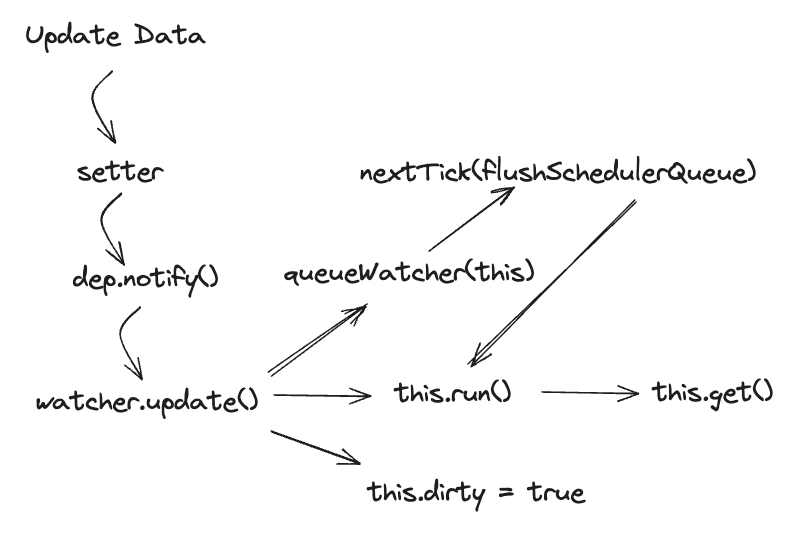

# Vue2 源码解析 —— 异步更新

在上文中我们已经知道了 Vue 会对页面渲染的所有属性都进行依赖收集，当对数据进行更新操作时，比如 `obj.key = 'new val'` 就会触发 setter 的拦截，从而检测新值和旧值是否相等，如果相等什么也不做，如果不相等，则更新值，然后由 dep 通知 watcher 进行更新。所以，**异步更新**的入口点就是 setter 中最后调用的 `dep.notify()` 方法。

```js
// setter
set: function reactiveSetter (newVal) {
      // 首先获取老的value
      const value = getter ? getter.call(obj) : val
      /* eslint-disable no-self-compare */
      if (newVal === value || (newVal !== newVal && value !== value)) {
        // 如果新老value相同 则不做处理
        return
      }
      /* eslint-enable no-self-compare */
      if (process.env.NODE_ENV !== 'production' && customSetter) {
        customSetter()
      }
      // #7981: for accessor properties without setter
      if (getter && !setter) return // 如果只有getter没有setter 说明是readonly的 也不做处理
      if (setter) {
        // 使用新的value替换老值
        setter.call(obj, newVal)
      } else {
        val = newVal
      }
      // 对新的val进行响应式处理 -> 也就是说如果 set 的值是一个新对象，则再进行一次响应式处理，重写这个对象的 setter 和 getter
      childOb = !shallow && observe(newVal)
      // 当响应式数据更新时 做依赖通知更新 --> 针对上面收集到的所有watcher 执行这些watcher自己的update方法 进入到异步更新阶段
      // dep.notify 会针对 dep.subs() 中的每一项都触发 watcher.update()，视图重新渲染
      dep.notify()
    }
```

然而，是否是数据一更新 Vue 就马上执行 Watchers 定义的 Callback 函数呢？想象一下，在一个宏任务中，我们可能同时要修改一系列的属性，如果每修改一个属性我们就立即运行相关的 Watchers，那么就有可能导致
  - 当多个不同的属性被同一个 Watcher 监听的时候，该 Watcher 的回调函数被不断的触发。
  - 当对同一个值进行多次更新的时候，每一次更新都要触发相同的 Watchers。

因此，为了使运行更流畅，在 setter 触发后，回调函数不会立即运行，而是进入到 Vue 的异步更新队列。也就是说，Vue 有**异步更新**的特点。

## `notify()`
```js
/**
   * 通知 dep 中的所有 watcher，执行 watcher.update() 方法
   */
  notify () {
    // stabilize the subscriber list first
    const subs = this.subs.slice()
    if (process.env.NODE_ENV !== 'production' && !config.async) {
      // subs aren't sorted in scheduler if not running async
      // we need to sort them now to make sure they fire in correct
      // order
      subs.sort((a, b) => a.id - b.id)
    }

    // 遍历当前dep收集到的所有watcher 让这些watcher依次执行update方法
    for (let i = 0, l = subs.length; i < l; i++) {
      subs[i].update()
    }
  }
```
setter 中的 dep.notify() 如上，注意到在依赖收集阶段每一个属性对应的 Dep 对象也收集了所有监听它的 Watcher 储存到 subs 属性中，因此这一步的本质就是让所有监听自己的 Watchers 都执行 `update` 方法

## `update()`
```js
/**
   * 根据 watcher 配置项，决定接下来怎么走，一般是 queueWatcher
   */
  update () {
    /* istanbul ignore else */
    if (this.lazy) { 
      // 由于 computed 属性必定有 lazy = true，因此他没有办法进入 queueWatcher(this) 这个分支
      // 而只有进入了 queueWatcher，才会有 nextTick 函数来处理异步操作，这也是为什么 computed 没有办法异步
      this.dirty = true 
      // 将dirty设置为true 在组件更新之后当响应式数据再次被更新的时候 执行computed getter
      // 重新执行computed回调函数，计算新值，然后缓存到 watcher.value
    } else if (this.sync) {
      // 同步执行的时候会走到这里，比如 this.$watch() 增加侦听器的时候，传递一个{sync: true}配置
      this.run()
    } else {
      // 将当前watcher放入到watcher队列，一般都是走到这个分支
      queueWatcher(this)
    }
  }
```

在 update 方法中，我们主要根据 watcher 的配置项，来决定接下来该怎么行动
- 如果是 computed 计算属性创建的 watcher，那么只不过是把 dirty 属性设置为 true，当组件重新渲染执行 getter 的时候，会重新计算计算属性的值 —— 懒加载
- 如果是你特别声明了 `{sync: true}` 的 watcher，那么会直接执行 `run()` 方法，执行 watcher 创建时声明的回调函数
- 默认会调用 `queueWatcher(this)`，将当前的这个 watcher 对象放入到一个异步队列中

## `queueWatcher(watcher: Watcher)`
```js
export function queueWatcher (watcher: Watcher) {
  const id = watcher.id // 拿到当前watcher的id
  if (has[id] == null) { // 判重，watcher不会重复入队 --> 也就是说在一个周期内，一个数据多次触发更新的时候 这个数据的watcher不会重复入队
    // 除此以外，例如 renderWatcher，一个 watcher 同时是多个数据的 watcher，它也不会被重复入队
    has[id] = true
    if (!flushing) {
      // 如果flushig = false 表示当前 watcher 队列没有在被刷新了，watcher直接入队
      queue.push(watcher)
    } else {
      // if already flushing, splice the watcher based on its id
      // if already past its id, it will be run next immediately.
      // watcher 队列正在被刷新，这时候这个 watcher  入队就需要特殊操作了
      // 因为queue在刷新的时候会根据watcher id由小到大进行排序，然后再从最小的watcher开始执行。因此中途新插入了一个watcher的话
      // 我们需要保证watcher id仍然是有序的，因此有了下面这个while循环和splice
      // TODO: 为什么要保证 watcher id 有序？ 
      let i = queue.length - 1
      while (i > index && queue[i].id > watcher.id) {
        i--
      }
      queue.splice(i + 1, 0, watcher)
    }
    // queue the flush
    if (!waiting) {
      // waiting 为 false 的时候走这里，表示当前浏览器的异步任务队列中没有 flushScheulerQueue 函数
      waiting = true

      if (process.env.NODE_ENV !== 'production' && !config.async) {
        // 同步执行的时候 直接去刷新watcher队列
        // 同步执行的时候性能会大打折扣
        // 主要是为了兼容 SSR，SSR的时候会需要同步执行 
        flushSchedulerQueue()
        return
      }
      // 我们熟悉的那个nextTick，this.$nextTick或者Vue.nextTick
      // 通过这么一层封装，我们会把 flushSchecheulerQueue 函数放到浏览器的异步任务队列中
      nextTick(flushSchedulerQueue)
    }
  }
}
```

queueWatcher 函数本质上就是完成以下几个操作
- 首先判重，确保在一个周期内，就算数据多次触发更新，这个数据的 watcher 不会重复进入队列
- 其次将 watcher 插入 watcher 队列
    - 需要按照 watcher id 进行插入
    - 如果当前队列中这个 id 已经被略过了 那么立马执行这个 watcher
- 最后调用 `nextTick(flushSchedulerQueue)`

当然，这里我们留了一个小问题，为什么需要按照 watcher id 的顺序进行入队和执行？这个问题在下一节就会解答。

## `flushSchedulerQueue`
```js
function flushSchedulerQueue () {
  currentFlushTimestamp = getNow()

  // 将flushing设置为true -- 表示现在的watcher队列正在被刷新
  flushing = true
  let watcher, id

  // Sort queue before flush.
  // This ensures that:
  // 1. Components are updated from parent to child. (because parent is always
  //    created before the child)
  // 2. A component's user watchers are run before its render watcher (because
  //    user watchers are created before the render watcher)
  // 3. If a component is destroyed during a parent component's watcher run,
  //    its watchers can be skipped.
  queue.sort((a, b) => a.id - b.id)

  // do not cache length because more watchers might be pushed
  // as we run existing watchers
  // for循环遍历队列 执行 watcher 的 run 方法。注意这里用的是queue.length 为啥不在外面先存一个len = queue.length呢？
  // 因为刷新队列的时候 watcher 队列可能会放入新的watcher，因此queue.length不可以写死！
  for (index = 0; index < queue.length; index++) {
    watcher = queue[index]
    // 首先执行before钩子，before钩子是创建watcher实例的时候在第四个参数的Obj里传入的
    if (watcher.before) {
      watcher.before()
    }
    // 清空缓存 表示当前watcher已经被执行了， 当该watcher再次入队的时候 就可以成功入队了
    id = watcher.id
    has[id] = null
    // 执行run方法 最终触发更新函数 比如updateComponent或者获取this.xx (xx为用户watch的第二个参数)
    watcher.run()
  }

  // keep copies of post queues before resetting state
  const activatedQueue = activatedChildren.slice()
  const updatedQueue = queue.slice()

  resetSchedulerState() // waiting 和 flushing 重新设置为 false；重置 has 缓存对象

  // call component updated and activated hooks
  callActivatedHooks(activatedQueue)
  callUpdatedHooks(updatedQueue)
}
```

flushSchedulerQueue 函数其实就做了三件事情
- 执行异步队列中所有 watcher 的 run 方法
- 重置一些全局变量
- 调用一些 Hooks

而在这段代码中也解释了，为什么我们需要给 watcher 按序插入队列和执行
- Component 从父组件到子组件进行更新，因此父组件中的 Watcher 也会优先于子组件中的 Watcher 先创建和先执行。假如先执行子组件的watcher再执行父组件的watcher，那么子组件watcher先执行一次，父组件更新的时候子组件的 watcher 可能又要执行一次 先后执行了两次
- 一个组件的 user watchers 会先于 render watcher 触发，假设先执行 render watcher 页面已经重渲染了，但是 user watchers 中又修改了一些页面的属性，导致 render watcher 又需要重新渲染...
- 如果一个父组件的 watcher 运行的时候会 destroy 这个父组件，那么其子组件的 watcher 就可以被跳过

## `nextTick (cb?: Function, ctx?: Object)`
```js
export function nextTick (cb?: Function, ctx?: Object) {
  let _resolve
  callbacks.push(() => {
    if (cb) {
      // 将nextTick传入的回调函数用try catch包装一层，方便异常捕获
      // 然后将包装后的函数放到这个callbacks数组之中
      try {
        cb.call(ctx)
      } catch (e) {
        handleError(e, ctx, 'nextTick')
      }
    } else if (_resolve) {
      _resolve(ctx)
    }
  })
  if (!pending) {
    // pending 为 false 的时候执行 timerFunc() -- 利用浏览器的异步任务队列
    // 在浏览器的任务队列中（首选微任务队列）放入 flushCallbacks 函数
    pending = true
    timerFunc()
  }
  // $flow-disable-line
  if (!cb && typeof Promise !== 'undefined') {
    return new Promise(resolve => {
      _resolve = resolve
    })
  }
}
```
这里的 nextTick 函数其实也就是我们常常使用的 Vue.nextTick 函数！
完成了这些事情：
 - 用 try catch 包装输入的回调函数（例如 flushSchedulerQueue），然后将其放入 callbacks 数组
 - 如果 pending 为 false，表示现在浏览器的任务队列中没有 flushCallbacks 函数，此时执行 timerFunc()


 ## `timerFunc`
 ```js
 let timerFunc // 就是一个有降级的func，如果浏览器有promise就用promise，如果实在啥都没有了 就用setTimeout()

// The nextTick behavior leverages the microtask queue, which can be accessed
// via either native Promise.then or MutationObserver.
// MutationObserver has wider support, however it is seriously bugged in
// UIWebView in iOS >= 9.3.3 when triggered in touch event handlers. It
// completely stops working after triggering a few times... so, if native
// Promise is available, we will use it:
/* istanbul ignore next, $flow-disable-line */

// 注意：这些逻辑在next-tick.js被引入的时候就会执行了 --> 可以加一行 alert(1)验证一下
// 首先 promise
if (typeof Promise !== 'undefined' && isNative(Promise)) {
  const p = Promise.resolve()
  timerFunc = () => {
    p.then(flushCallbacks)
    // In problematic UIWebViews, Promise.then doesn't completely break, but
    // it can get stuck in a weird state where callbacks are pushed into the
    // microtask queue but the queue isn't being flushed, until the browser
    // needs to do some other work, e.g. handle a timer. Therefore we can
    // "force" the microtask queue to be flushed by adding an empty timer.
    if (isIOS) setTimeout(noop)
  }
  isUsingMicroTask = true
} else if (!isIE && typeof MutationObserver !== 'undefined' && (
  isNative(MutationObserver) ||
  // PhantomJS and iOS 7.x
  MutationObserver.toString() === '[object MutationObserverConstructor]'
)) {
  // Use MutationObserver where native Promise is not available,
  // e.g. PhantomJS, iOS7, Android 4.4
  // (#6466 MutationObserver is unreliable in IE11)
  let counter = 1
  const observer = new MutationObserver(flushCallbacks)
  const textNode = document.createTextNode(String(counter))
  observer.observe(textNode, {
    characterData: true
  })
  timerFunc = () => {
    counter = (counter + 1) % 2
    textNode.data = String(counter)
  }
  isUsingMicroTask = true
} else if (typeof setImmediate !== 'undefined' && isNative(setImmediate)) {
  // Fallback to setImmediate.
  // Technically it leverages the (macro) task queue,
  // but it is still a better choice than setTimeout.
  timerFunc = () => {
    setImmediate(flushCallbacks)
  }
} else {
  // Fallback to setTimeout.
  timerFunc = () => {
    setTimeout(flushCallbacks, 0)
  }
}
```
timerFunc 本质上是一个函数，但是 Vue 需要通过不断检测当前运行时的能力决定 timerFunc 是一个怎样的函数。因此这里其实是一个层层降级的赋值过程。优先级是 Promise -> MutationObserver -> setImmediate -> setTimeout

从这里我们可以看出来我们本质上是要异步执行 `flushCallbacks` 函数

## `flushCallbacks()`
```js
function flushCallbacks () {
  pending = false
  const copies = callbacks.slice(0)
  callbacks.length = 0
  for (let i = 0; i < copies.length; i++) {
    copies[i]()
  }
}
```
三件事情：
1. 将pending重新设置为false 表示下一个 flushCallbacks 可以进入浏览器的异步任务队列了
2. 清空callbacks数组
3. 执行callbacks数组中的所有函数
     - flushSchedulerQueue
     - 用户自己调用 this.$nextTick 传入的Callback函数

因此，在这里我们刚刚的 `flushCallbacks` 函数才真正的被执行。

## `watcher.run()`

flushSchedulerQueue 会执行所有的 watcher 的 run 函数
```js
/**
   * Scheduler job interface.
   * Will be called by the scheduler.
   */
  /**
   * 由 刷新队列函数 flushSchedulerQueue 调用，完成如下几件事：
   *   1、执行实例化 watcher 传递的第二个参数，updateComponent 或者 获取 this.xx 的一个函数(parsePath 返回的函数)
   *   2、更新旧值为新值
   *   3、执行实例化 watcher 时传递的第三个参数，比如用户 watcher 的回调函数
   */
  run () {
    if (this.active) {
      const value = this.get()
      if (
        value !== this.value ||
        // Deep watchers and watchers on Object/Arrays should fire even
        // when the value is the same, because the value may
        // have mutated.
        isObject(value) ||
        this.deep
      ) {
        // set new value
        const oldValue = this.value
        this.value = value
        if (this.user) {
          // 用户watcher 再执行一下watch回调
          // watch(() => {}, (val, oldVal) => {})
          const info = `callback for watcher "${this.expression}"`
          invokeWithErrorHandling(this.cb, this.vm, [value, oldValue], this.vm, info)
        } else {
          this.cb.call(this.vm, value, oldValue)
        }
      }
    }
  }
```

## `watcher.get()`

```js
get () {
    pushTarget(this) // Dep.target = this 也就是收集依赖 -- 为啥执行更新的时候又要重新收集依赖呢？
    // 当响应数据被更新的时候才会走到这一步 此时需要对新的 value 进行依赖收集
    let value
    const vm = this.vm
    try {
      // 执行实例化watcher传递进来的第二个参数
      // 有可能是个函数，比如 实例化渲染 watcher时传递的 updateComponent函数 然后进入patch阶段
      // 也有可能是用户watcher 传递的可能是一个key 也可能是读取this.key的函数
      // 触发读取操作后，被getter拦截 进行依赖收集
      // 举一个例子，如果执行了updateComponent的话，那么会触发update和render，然后会触发页面中被用到的数据的setter，响应式的触发依赖收集等步骤
      value = this.getter.call(vm, vm) // 关键的是这一步骤！！！ this.getter就是刚刚实例化watcher时传递进来的第二个参数，即computed的getter函数
    } catch (e) {
      if (this.user) {
        handleError(e, vm, `getter for watcher "${this.expression}"`)
      } else {
        throw e
      }
    } finally {
      // "touch" every property so they are all tracked as
      // dependencies for deep watching
      if (this.deep) {
        traverse(value)
      }
      popTarget()
      this.cleanupDeps()
    }
    return value // 用户watcher的时候会返回一个执行结果
  }

```

`get` 方法乍一看很简单，但其实在很多场合被调用，因此其实是非常重要的方法！

***Case 1: 当我们 initWatcher 的时候，会触发 this.get()***
在进入这个函数之前，我们已经成功新创建了一个 watcher，但是这个 watcher 和我们需要监听的属性之间还没有产生任何关联, 我们监听的属性在 initData 的时候被处理过了，已经有了一个属于它的 Dep 对象，我们希望将自己这个 watcher 给添加到这个 Dep.subs 中，这样，当我们监听的属性的 setter 被触发的时候，就会有 dep.notify()，我们新的 watcher 就会响应。因此，我们在 get() 方法中调用了 this.getter(), 在 getter 的时候就会有 dep.depend() 操作，实现上文的目的
   
***Case 2: 从 computed 属性的视角来看，调用 get() 函数的时机***
假设我们有一个 key 叫做 computedAge, 还有一个 data 叫做 age。当我们第一次 `{{ computedAge }}` 的时候，触发 computedGetter -> watcher.evaluate() -> watcher.get() -> this.getter()。
其中，`this.getter()` 会获取 age 的值，触发 age 的 getter，此时，age 的 dep 中就会有 computedAge 的 watcher。然后，每次获取 computedAge 的时候，因为 dirty = false，因此会直接返回缓存的值，不会再次触发 getter。  
后续，当 age 更新的时候，dep.notify()，会更新所有的相关的 watcher，其中就包括了 computedAge 的 watcher，并且 dirty = true，当我们再次获取 commputedAge 的时候，就会重复这个流程
  
***Case 3: 在 mountComponent 方法中***
在 mountComponent 方法中，会执行一个 `new Watcher(vm, updateComponent, noop, cb, true)`。而这个就是 render watcher，它触发了 get 方法，在 get 方法中，会调用 this.getter()，也就是 updateComponent。
updateComponent 中会调用 vm._update(vm._render(), hydrating)，其中 vm._render() 会触发 vm 上的各种属性的 getter。因此，收集了所有的属性的依赖。


## 总结



### 1. 为什么 Vue.nextTick(cb) 中，我们可以访问到更新后的 DOM？

当我们更新数据的时候，**数据的更新是同步的，而 DOM 的更新是异步的**，因此在下面这个例子中，如果我们直接数据更新后立刻访问 DOM，我们得到的仍然是旧的值。

```js
this.msg = "after"
this.$nextTick(function(){
  console.log(this.$refs.btn.innerText) // "after"
})
console.log(this.$refs.btn.innerText) // "before"
```

而官方提供了一个 nextTick 方法，可以让其中的回调函数访问到更新后的 DOM！这是怎么做到的呢？
我们注意到 nextTick 的本质就是将回调函数放入到 callbacks 队列中。而当数据更新的时候，我们首先会将 flushSchedulerQueue 给放入到队列中，然后再将此时的 cb 放入到队列中。  
队列中的函数会按照顺序执行，执行 flushSchedulerQueue 的时候 user watchers 和 render watcher 都会被执行，**而在执行完 render watcher 之后，DOM 的数据已经更新了**！此后再执行 cb，访问到的就是更新后的 DOM。

### 2. Vue 数据更新的时候到底发生了什么？

首先这个数据立马被 set 更新（**同步数据更新**），其 setter 被触发，会 notify 所有的 watcher。  
将这些 watcher 放入到一个全局的队列中，然后通过 nextTick 方法将一个刷新 watcher 队列的方法（flushSchedulerQueue）放入一个全局的 callbacks 数组中。
如果此时浏览器的异步任务队列中没有一个叫 flushCallbacks 的函数，则执行 timerFunc 函数，将 flushCallbacks 函数放入异步任务队列。如果异步任务队列中已经存在 flushCallbacks 函数，等待其执行完成以后再放入下一个 flushCallbacks 函数。  
flushCallbacks 函数负责执行 callbacks 数组中的所有 flushSchedulerQueue 函数。  
flushSchedulerQueue 函数负责刷新 watcher 队列，即执行 queue 数组中每一个 watcher 的 run 方法，从而进入更新阶段，比如执行组件更新函数或者执行用户 watch 的回调函数。  

### 3. 为什么 timerFunc 倾向于使用 Promise 而不是 setTimeout？

这其实和浏览器的渲染规则有关，Promise 的话，我们的 flushCallbacks 函数会被放在 microtask 队列中，而 setTimeout 则会将函数放在下一个 macrotask 队列中。  
***而浏览器渲染的时候，要求当前的 microTask queue 被清空***，因此，将 flushCallbacks 放在 microtask queue 中，可以确保当浏览器要渲染的时候，里面的 render watcher 已经被执行了，DOM 已经被更新了。
相应的，如果用 setTimeout 来处理这些 watcher 回调的话，当浏览器渲染的时候，可能并没有执行 render watcher 中的 DOM 更新部分，那么用户就会***感知到掉帧***。尤其是，如果前一个 macroTask 耗时特别长，那么掉帧的概率就会急剧增大。

  
至此，Vue 的响应式原理和异步更新部分就已经讲解完了，这两个特性在源代码中的位置相近并且逻辑存在一定的耦合。这篇文章和下面两篇文章一起阅读，可以帮助促进理解！
* [Vue2 源码解析: Computed 和 Watch 的区别](https://github.com/kiki-zjq/Blog/issues/2)
* [Vue2 源码解析: 响应式原理](https://github.com/kiki-zjq/Blog/issues/5)